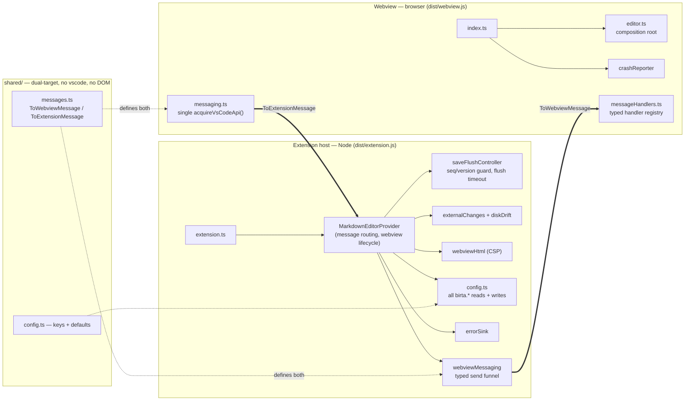
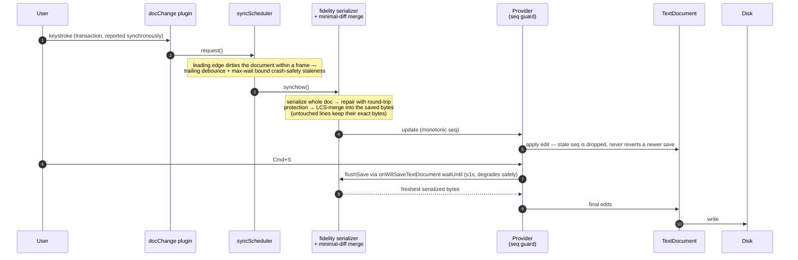
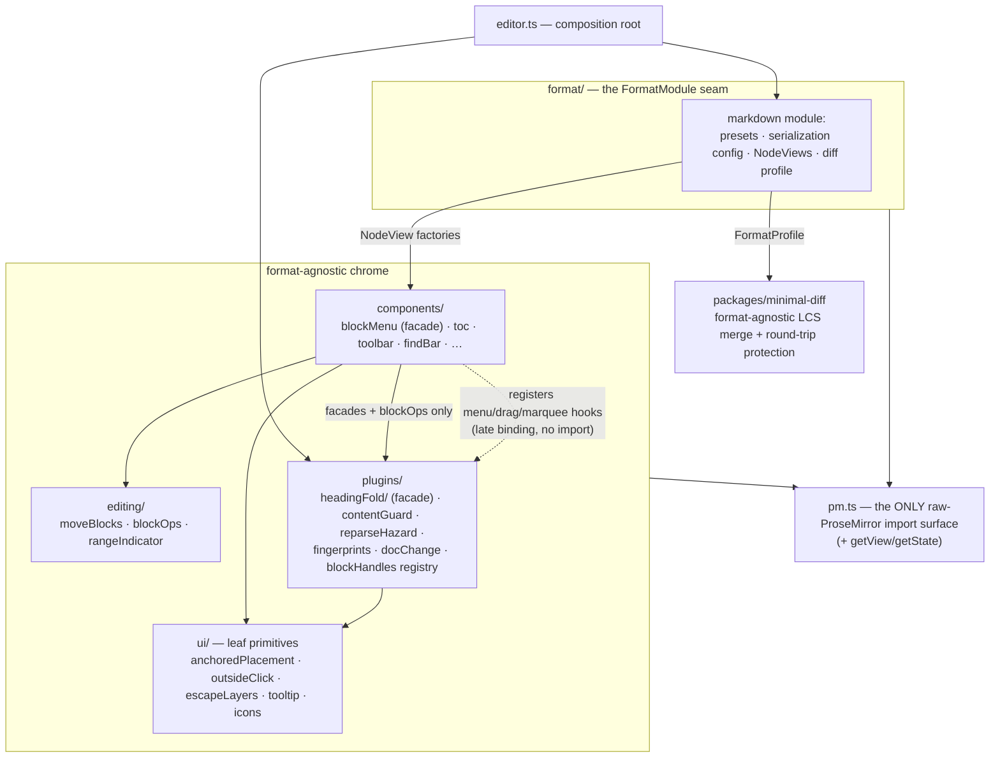
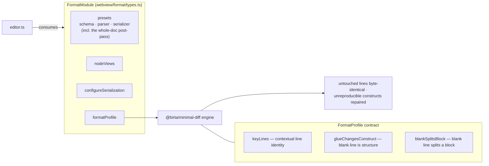
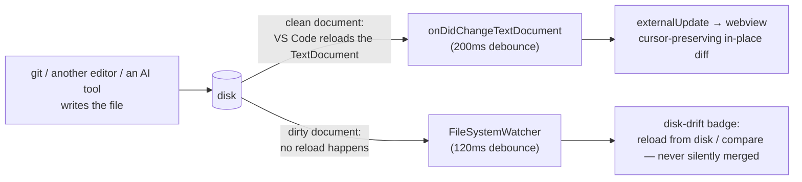

# Birta Writer

[GitHub](https://github.com/harlanlewis/birta-writer)

> **Birta Writer** is maintained by [Harlan Lewis](https://www.harlanlewis.com). It began as a personal fork of [git-xing/md-wysiwyg-editor](https://github.com/git-xing/md-wysiwyg-editor) (MIT), is now developed independently, and is not affiliated with or endorsed by the upstream project. Birta Writer is source-available under the [Functional Source License (FSL-1.1-ALv2)](LICENSE); the upstream-derived portions remain under the MIT License they were published under (see [NOTICE](NOTICE) and [LICENSE-MIT](LICENSE-MIT)).
>
> **In plain English:** you can read, run, modify, and share the source for any purpose — including internal and paid work at your company — *except* using it to build a product or service that competes with Birta Writer. Each release automatically converts to the permissive [Apache-2.0](https://www.apache.org/licenses/LICENSE-2.0) license two years after it ships, so the code is never permanently locked up. This is not OSI-approved "open source," but the source is fully open to inspection and self-hosting. (The [LICENSE](LICENSE) text governs; this summary doesn't.)

Birta Writer is a VS Code WYSIWYG Markdown editor extension powered by [Milkdown](https://milkdown.dev/) (ProseMirror). Edit `.md` / `.markdown` files as rich text and save as standard Markdown — fully compatible with any text editor.

For what the editor does well and *why it matters* — including its fidelity/safety guarantees and a [compatibility table](#compatibility-with-other-markdown-tools) for other Markdown tools — see [**docs/BENEFITS.md**](docs/BENEFITS.md).

***

## Why this fork

**North star: never leave WYSIWYG.** A user opens a `.md` file in WYSIWYG mode and never *needs* the raw text editor unless they genuinely prefer it. Every change is judged by one question: *does this remove a reason to pop out?* The pop-out itself stays polished and instant — even the most mature competitors ship a one-keystroke escape hatch as a first-class feature. It's a safety net, not a wall.

Investment follows an ordering the evidence made unambiguous — from a survey of this codebase, upstream, competing VS Code WYSIWYG extensions (vscode-markdown-editor, vscode-office, unotes), Milkdown's own tracker, and capability-diffing against Typora, Obsidian Live Preview, and MarkText:

1. **Fidelity and trust first — it's existential.** The #1 trust-killer in every competitor's tracker is round-trip infidelity: "it reformatted my file", "it lost content". One competitor was un-published from the Marketplace over exactly this ([unotes](https://github.com/ryanmcalister/unotes)); upstream has a live corruption report ([git-xing#14](https://github.com/git-xing/md-wysiwyg-editor/issues/14)); MarkText's most-reacted bug is "document is modified just by opening it" ([marktext#2189](https://github.com/marktext/marktext/issues/2189)). One corruption event sends a user back to raw mode permanently. This fork's minimal-diff serializer, round-trip regression corpus, and destructive-diff save guard exist because of this.
2. **VS Code parity second.** The custom-editor API deliberately provides nothing — no find, no undo integration, no search reveal ("that's all intentionally left up to extensions", [microsoft/vscode#86802](https://github.com/microsoft/vscode/issues/86802)) — so parity users feel daily is hand-built here: find/replace, command palette and context-menu commands, Go-to-Symbol, user-rebindable keybindings, theme fidelity.
3. **Parser and syntax breadth third.** Math, footnotes, frontmatter, reference links — and anything the schema can't represent must degrade to *visible but safe*, never a silent deletion, so the editor is trustworthy on any file.
4. **Interaction patterns last.** The polish that makes the editor *preferred* rather than merely tolerated, invested in once the layers beneath it held: slash commands, a full block-interaction system (gutter grabbers on every block, a block menu, drag-to-move, marquee and keyboard block selection) — with smart paste still ahead.

***

## Features

### Blocks: grab, move, convert

Every block — paragraphs, headings, list items (at any depth), quotes, callouts, directives, code blocks, tables, images, footnotes, even blocks nested inside callouts and quotes — has a gutter handle showing its slash-menu icon. **Click it for the block menu** (turn into, duplicate, copy as markdown, move, delete; headings get copy-link and whole-section moves), **drag it to move the block** — with an accent drop line, auto-scroll, and one-step undo. A handle click only ever selects the block or opens its menu — it never edits the block's content (task-list checkboxes included). Select many blocks with a **marquee drag in the margins** or from the keyboard (**Escape** selects the current block, **Shift+↑/↓** extend, **Cmd+A** ladders block → document, **Alt+↑/↓** move), then drag any covered handle to move them all. Headings carry their sections, collapsed content always travels with its heading, and Tab/Shift-Tab indent list items one level without dragging their children along.

### Rich Text Editing

- **Headings** (H1–H6), **bold**, *italic*, ~~strikethrough~~, `inline code`, blockquote, horizontal rule
- **Ordered / Unordered / Task lists** (click checkbox to toggle completion)
- **Links**: hover to show a popup for editing link text and URL inline, with a **format switch** (standard markdown ⇄ `[[wikilink]]`) that converts a link in place; supports `@/` workspace paths, `#anchor` in-page jumps, `file.md#27` line-number links, and `file.md#some-heading` cross-file heading jumps
- **Smart link resolution** (`birta.smartLinks`, on by default): local links resolve the way your site generator publishes them — workspace-root paths (`/docs/guide`), ancestor content roots (a Hugo file's `/write/uber` finds `content/write/uber/index.md`), `.md`/`index.md`/`_index.md` suffix inference, and a workspace-wide fallback. External links open through VS Code's own trusted-domains prompt — no extra dialog
- **Wikilinks**: `[[target]]`, `[[target|alias]]`, `[[target#heading]]` (Obsidian conventions) parse, render, navigate (bare names match by filename across the workspace), and round-trip byte-identically; typing `[[` opens name autocompletion. Anything the grammar doesn't match stays visible plain text
- **Path autocomplete**: type `@/`, `./`, or `../` inside inline code to get smart path suggestions — browse directories level by level with color-coded file-type icons

### Tables

- Full GFM table support
- Hover row/column borders to show **+ insert lines** — click to insert a row or column anywhere
- **Drag handles** on rows/columns: click to select, drag to reorder
- Insert lines and handles update in real time as the table grows

### Code Blocks

- Syntax highlighting for ~66 languages (grammars load lazily, so they cost nothing at launch)
- Language picker with search filter
- One-click copy button
- Drag the bottom handle to resize the code block height
- Full-screen editor with syntax highlighting; writes back to document on close

### Mermaid Diagrams

- Flowcharts, sequence diagrams, Gantt charts, class diagrams, and more rendered inline
- Toggle between source code and rendered preview
- Zoom, pan (drag / trackpad pinch), and full-screen lightbox

### Images

- **Paste** an image from the clipboard, **drag-and-drop** a file, or use the **file picker** to insert images
- Local storage with MD5 deduplication — images are always saved to your workspace and are **never uploaded off your machine**
- Click an image to select it; click again to open a lightbox preview
- Click-to-edit caption (the alt text) and a delete control

### Theming

- The editor follows your active VS Code color theme automatically — everything (text, code, callouts, tables, Mermaid diagrams) recolors from the theme's own palette
- Theme changes apply live, with no reload — including switching workbench theme and OS-driven light/dark switching
- Nothing to configure: there is no separate per-editor theme, so the rendered document always matches the rest of your editor

### Table of Contents (TOC)

- Auto-generated from document headings
- Auto-opens when the window is wide enough; toggle manually via the side tab
- Click an entry to smooth-scroll to the heading

### Toolbars

- **Top toolbar**: heading level, bold, italic, strikethrough, ordered/unordered list, task list, blockquote, code block, table
- **Floating selection toolbar**: appears on text selection; supports quick formatting
- **Table toolbar**: appears on row/column selection; supports alignment and delete operations

### In-Editor Search

- **`Cmd+F`** (macOS) / **`Ctrl+F`** (Windows): opens the FindBar to search within the document
- Matches highlighted in real time using the CSS Custom Highlight API
- Navigate matches with `Enter` / `Shift+Enter`, dismiss with `Esc`

### Saving

- The editor is backed by a native text document, so saving follows VS Code's built-in **`files.autoSave`** (set it to `afterDelay` to write automatically after editing stops). Unsaved edits show `●` in the tab title, just like any editor
- Switching between the rendered editor and Raw Markdown with unsaved edits prompts to Save / Don't Save / Cancel (Cancel keeps you where you are); it never opens a duplicate tab
- External file changes (e.g. `git checkout`, other editors) sync automatically to the editor

***

## Compatibility with other Markdown tools

Birta isn't a personal-knowledge-management tool — it reads and writes plain Markdown files. But because it preserves what it doesn't interpret (see [fidelity and safety](docs/BENEFITS.md#fidelity-and-safety-come-first)), it works well *on the files* of many tools people already use. Interop is a consequence of fidelity, not a design goal, so this is about what's safe to open and edit — not about matching each tool's feature set.

| Tool | Birta can open it | Notes |
| --- | --- | --- |
| **Obsidian** | 🟢 directly (`.md` vault) | Wikilinks, `==highlights==`, `> [!callouts]`, footnotes, math, and frontmatter render or round-trip; `#tags`, `^block-ids`, `![[embeds]]`, `%%comments%%` are preserved as text |
| **Foam** | 🟢 directly (`.md`) | Same wikilink family; its link-reference-definition shim is preserved, not inlined away |
| **"Second Brain" / PARA** | 🟢 directly | A folder convention, not a format — nothing tool-specific to preserve |
| **Logseq** | 🟡 opens (round-trip unverified) | Text is preserved, but its outliner model renders as one big nested list; whether Birta keeps the exact bullet indentation Logseq's structure needs is untested |
| **Quarto** (`.qmd`) | 🟡 needs a file association | Safe to round-trip; executable cells, `:::` fenced divs, shortcodes, and citations are preserved as inert text/code, not understood |
| **MDX** (`.mdx`) | 🔴 not recommended | MDX changes base Markdown rules and adds JSX/imports; re-serializing edited regions risks invalid MDX |
| **Roam Research** | 🔴 export first | Proprietary database (JSON/EDN), not files |
| **Bear** | 🔴 export first | Proprietary SQLite database, not files |
| **Emacs Org mode** | 🔴 out of scope | `.org` is a different markup language, not Markdown |

See [**docs/BENEFITS.md**](docs/BENEFITS.md#compatibility-with-other-markdown-tools) for the full breakdown, including per-tool syntax fidelity and the confidence caveat.

***

## Getting Started

After installing the extension, open any `.md` / `.markdown` file in VS Code — it opens in WYSIWYG mode automatically.

| Action                   | How                                                            |
| ------------------------ | -------------------------------------------------------------- |
| Switch to text editor    | Click the 👁 icon in the title bar, or right-click → Open With |
| Switch back to WYSIWYG   | Click the 👁 icon in the title bar                             |
| Insert row/column        | Hover a table row/column border, click **+**                   |
| Reorder rows/columns     | Hover the **⠿** handle, then drag                              |
| Select entire row/column | Click the **⠿** handle                                         |
| Path autocomplete        | Type `@/`, `./`, or `../` inside inline code                   |
| Search in document       | `Cmd+F` (macOS) / `Ctrl+F` (Windows)                           |
| Manual save              | `Cmd+S` (macOS) / `Ctrl+S` (Windows)                           |

***

## Settings

| Setting                              | Type    | Default     | Description                                                                               |
| ------------------------------------ | ------- | ----------- | ----------------------------------------------------------------------------------------- |
| `birta.defaultMode`        | string  | `"preview"` | Default mode when opening `.md`: `preview` (WYSIWYG) or `markdown` (text editor)          |
| `birta.codeBlockMaxHeight` | number  | `600`       | Maximum code block height in pixels                                                       |
| `birta.contentWidth`       | string  | `"full"`    | Content width: `full` (fill the pane) or `fixed` (cap at Max Content Width); also in the toolbar A menu |
| `birta.maxContentWidth`    | number  | `100`       | Max content width in ch when Content Width is `fixed` (scales with the content font size)              |
| `birta.fontPreset`         | string  | `"editor"`  | Content font: `editor` (follow the VS Code editor font), `sans`, `serif`, or `mono`; also switchable from the toolbar font picker |
| `birta.fontFamilySans`     | string  | system sans stack | Font-family stack used by the Sans serif preset                                     |
| `birta.fontFamilySerif`    | string  | serif stack | Font-family stack used by the Serif preset                                                |
| `birta.fontFamilyMono`     | string  | mono stack  | Font-family stack used by the Monospace preset                                            |
| `birta.fontSize`           | number  | `100`       | Content font size as a percentage of the VS Code editor font size (50–200)                |
| `birta.imageLocalPath`     | string  | `""`        | Relative path (from workspace root) for local image storage                               |
| `birta.smartLinks`         | boolean | `true`      | Resolve local links the way your site generator does: workspace-root paths, ancestor content roots, `.md`/`index.md` suffixes, and `[[wikilink]]` targets |
| `birta.tableWrap`          | string  | `"normal"`  | Table cell text wrapping: `normal`, `aggressive`, or `none`                               |
| `birta.blockHandles`       | string  | `"headings"` | Which block handles stay visible in the left gutter at rest: `headings` (H1–H6 badges, every other block on hover), `always` (every block's handle), or `hover` (none at rest, all on hover); hovering a block always reveals its handle. Also in the toolbar's typography (A) menu |

***

## Architecture

For contributors. The key-file map and working conventions live in [`CLAUDE.md`](CLAUDE.md); this section is the shape of the system. Every boundary drawn here is enforced by a convention test where one is named — these diagrams describe rules the suite pins, not intentions.

### The two processes

The extension runs as two bundles that only ever talk through one typed message protocol. Neither side sends a raw message: the webview funnels through `messaging.ts` (the single `acquireVsCodeApi()` call), the extension through `webviewMessaging.ts`, and both directions are discriminated unions defined once in `shared/` — a directory that is deliberately free of both `vscode` imports and DOM types so it can compile into either target.

Guards: `typedWebviewSends.test.ts` (no raw `postMessage` outside the funnel), `configDefaultsContributions.test.ts` (every `birta.*` key's default pinned against `package.json`).

### The save pipeline — why editing one line never rewrites another

This is the product's existential property (see *Why this fork*). The edit lives in the webview; the `TextDocument` is what VS Code saves; the pipeline between them serializes the **whole** document but writes only the lines that really changed.

Two properties are pinned hard: a save can never persist content older than the editor state, and the first edit after a save dirties the document within one IPC hop (`CLAUDE.md` → *Autosave* has the full invariants; `savePipeline.test.ts` and the integration suite enforce them, and `e2e/syncLatency` pins the scheduler's latencies).

Round-trip **protection** is the second half of fidelity: at load, the document is compared against its own zero-edit serialization; every construct the parser can't reproduce byte-for-byte (setext headings, escaping churn, reference-link styles…) is recorded and repaired back to its saved bytes on every later save — until the user actually edits that construct, at which point the edit wins.

### Webview layering

Dependency direction is the rule that keeps the webview refactorable. `ui/` is a leaf; components reach plugin state only through published facades; plugins import no components (the one inversion they need — block-menu wiring on fold gutters — is late-bound through a registry the plugin layer owns).

Guards: `pmFunnel.test.ts` (no `@milkdown/prose` import outside `pm.ts`), `blockMenuFacade.test.ts` (no deep imports into blockMenu; no component imports under the fold hub).

### The format and diff seams

The same injection shape appears at two levels: the editor consumes a `FormatModule`, and the minimal-diff engine consumes a `FormatProfile`. Markdown is format #1; a second format supplies both objects and the unchanged chrome honors them (the multiformat track, MAR-40, tracks what's still deliberately deferred).

The serializer itself is a vendored, patched copy of Milkdown's `SerializerState` (`plugins/fidelitySerializer.ts`); its four divergences from upstream are enumerated in its header, and `fidelitySerializerDrift.test.ts` pins the upstream sources' hashes so a Milkdown bump can't silently diverge from the patched copy.

### External changes — two mechanisms, on purpose

Two structurally different questions get two signal sources; the division is an ADR in `src/externalChanges.ts`, not an accident. VS Code never applies a disk write to a *dirty* document, so neither mechanism can cover the other's case.

The webview marks inbound syncs with a transaction meta (`EXTERNAL_SYNC_META`) so per-transaction consumers can recognize them, while the save pipeline suppresses the echo with a span over the dispatch — the two mechanisms answer different questions, and the comment at the flag's declaration in `editor.ts` records why they can't be unified (the attempt is documented; it failed its own pinning test).

***

## Requirements

- VS Code **1.80.0** or later

***

## Known Limitations

- **Editable inline/block HTML** is not yet supported — embedded HTML renders read-only, and editing it requires switching to the raw text editor
- **Global search navigation**: clicking a search result for a `.md` file may not scroll to the matched line in WYSIWYG mode when multiple `.md` files are open simultaneously
- **True multi-caret editing, column (box) selection, and transpose** are deliberately not reimplemented — pop to the raw editor for those (⇧⌘M "Edit Raw Markdown", which round-trips losslessly); in-editor, ⌘D occurrence cycling and regex Replace All cover the common "change every X" cases
