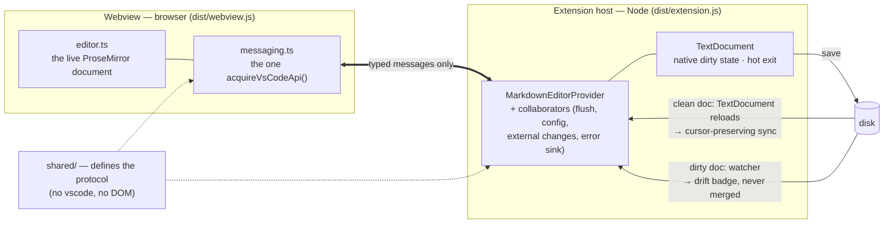
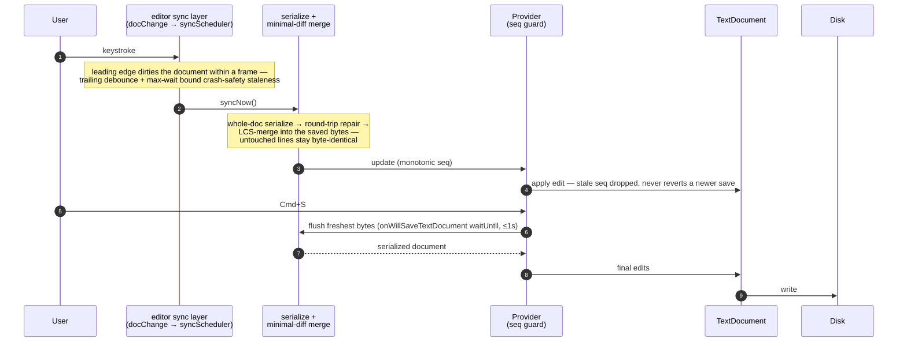
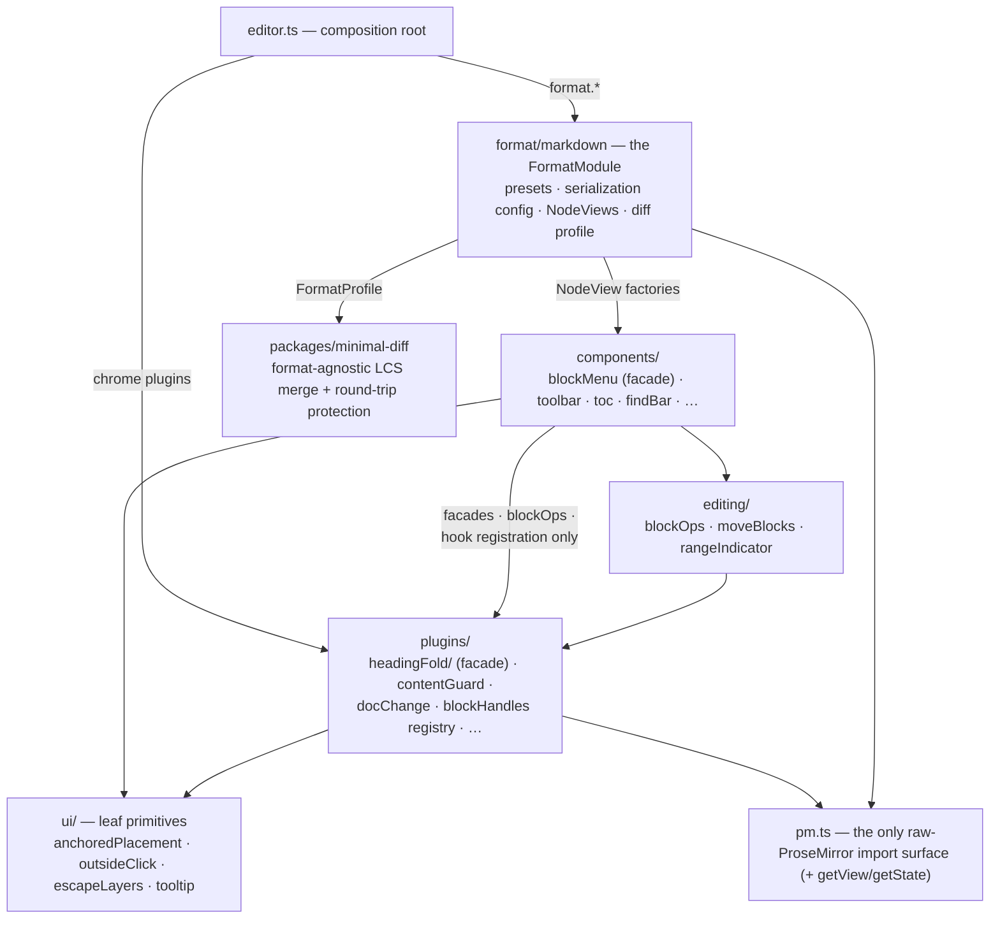

# Birta Writer

[GitHub](https://github.com/harlanlewis/birta-writer)

Birta Writer is a VS Code extension that opens `.md` / `.markdown` files as rich text — headings, tables, images, math, diagrams — and saves standard Markdown any tool can read. It is built on [Milkdown](https://milkdown.dev/) (ProseMirror), backed by a native VS Code text document, and designed around one promise: **editing one part of a file never rewrites another**. Untouched lines keep their exact bytes; anything the editor can't render is preserved, never silently dropped.

Maintained by [Harlan Lewis](https://www.harlanlewis.com); a hard fork of [git-xing/md-wysiwyg-editor](https://github.com/git-xing/md-wysiwyg-editor), now developed independently. Source-available under FSL-1.1-ALv2 — details and the plain-English summary in [License & attribution](#license--attribution).

For the *why it matters* version of what follows — the fidelity/safety guarantees and per-tool details — see [**docs/BENEFITS.md**](docs/BENEFITS.md).

***

## Features

### Your file stays yours

- **Byte-faithful round-trips** — the editor serializes your document and merges only the lines that really changed; formatting you chose (table padding, blank-line style, reference-link forms, setext headings) survives edits elsewhere in the file
- **Nothing is silently lost** — constructs Birta doesn't understand (Obsidian `#tags`, `%%comments%%`, Quarto cells, raw HTML) stay visible and untouched; a move or drop that would corrupt content on save is quietly declined instead of half-applied
- **A disk-drift badge** warns when a file with unsaved edits changes on disk (git, a terminal, an AI assistant) — reload or compare side by side; the editor never silently overwrites or merges
- **No network egress** — images save into your workspace, remote loads are blocked, proofreading runs offline; document content has no path off your machine

### Blocks: grab, move, convert

Every block — paragraphs, headings, list items (at any depth), quotes, callouts, directives, code blocks, tables, images, footnotes, even blocks nested inside callouts and quotes — has a gutter handle showing its slash-menu icon. **Click it for the block menu** (turn into, duplicate, copy as markdown, move, delete; headings get copy-link and whole-section moves), **drag it to move the block** — with an accent drop line, auto-scroll, and one-step undo. Select many blocks with a **marquee drag in the margins** or from the keyboard (**Escape** selects the current block, **Shift+↑/↓** extend, **Cmd+A** ladders block → document, **Alt+↑/↓** move), then drag any covered handle to move them all. Headings carry their sections, collapsed content always travels with its heading, and Tab/Shift-Tab indent list items one level without dragging their children along.

### Writing

- **All the basics**: headings H1–H6, **bold**, *italic*, ~~strikethrough~~, `inline code`, ==highlight==, blockquotes, horizontal rules, ordered/unordered/task lists (click a checkbox to toggle)
- **Slash menu**: type `/` at a block start (or after a space) for insertable everything — headings, lists, callouts, tables, code, math, footnotes — filtering as you type
- **Callouts**: GitHub-style `> [!note]` / `[!tip]` / `[!warning]` … render with icons and accent colors; `[!kind]-` markers start collapsed; Notion-style asides are preserved too
- **Math**: inline `$…$` and block `$$…$$` rendered with KaTeX (loaded lazily); click to edit the source in place
- **Footnotes**: insert, edit, and follow `[^1]`-style footnotes; definitions render at the end with back-references
- **Frontmatter**: YAML frontmatter renders as an editable key/value table at the top of the document (collapsible; `birta.frontmatterExpanded`)
- **Occurrence editing**: `Cmd+D` cycles through occurrences of the selection, `Cmd+Shift+L` selects them all — the common "change every X" cases without leaving WYSIWYG

### Proofreading — offline

Spelling, grammar, and style checking runs entirely on your machine (the [Harper](https://writewithharper.com) engine via WASM — nothing is sent anywhere). Style checks cover fillers, redundancies, clichés, wordiness, passive voice, long sentences, and AI-writing tells (vocabulary, artifacts, em-dash habits, non-ASCII punctuation) — each rule individually toggleable under `birta.styleCheck.*`. Findings are quiet dotted underlines with suggested fixes in a hover popup; "Add to dictionary" writes to your personal (never workspace) settings. Toggle everything with `Cmd+Alt+Shift+D` or the toolbar checks menu.

### Folding and navigation

- **Fold anything with structure**: heading sections, callouts, list items, tables, code blocks (`Cmd+Alt+[` / `Cmd+Alt+]`, fold-all/unfold-all commands, chevrons in the gutter). Folds persist across reopen, travel with drags — and an edit can never hide content you could see: a fold opens rather than silently swallowing anything
- **Table of contents**: auto-generated outline that is also a structural editor — **drag a TOC entry to move its whole section**, and drops that change nesting relevel the headings; click to jump
- **Sticky headings** keep your current section's heading pinned while you scroll; **Go to Symbol** (`Cmd+Shift+O`) jumps by heading; a **word count** for the document (or selection) lives in the status bar

### Links

- **Inline link editing**: hover a link for a popup with text/URL editing and a **format switch** (markdown ⇄ `[[wikilink]]`); supports `@/` workspace paths, `#anchor` jumps, `file.md#27` line links, and cross-file heading links
- **Smart link resolution** (`birta.smartLinks`): local links resolve the way your site generator publishes them — workspace-root paths, ancestor content roots, `.md`/`index.md`/`_index.md` inference; external links open through VS Code's own trusted-domains prompt
- **Wikilinks**: `[[target]]`, `[[target|alias]]`, `[[target#heading]]` (Obsidian conventions) parse, render, navigate, and round-trip byte-identically; typing `[[` opens name autocompletion
- **Path autocomplete**: `@/`, `./`, `../` inside inline code browse the workspace with file-type icons

### Tables

Full GFM support: hover a border for **+ insert lines**, click **⠿ handles** to select rows/columns, drag them to reorder, align columns from the table toolbar — all updating live as the table grows. Shift+Enter inserts a line break inside a cell.

### Code and diagrams

- Syntax highlighting for ~66 languages (grammars load lazily — they cost nothing at launch), a searchable language picker, one-click copy, drag-to-resize height, and a full-screen editor
- **Mermaid** diagrams render inline with source/preview toggle, zoom, pan, and a full-screen lightbox; the theme follows your editor (`birta.mermaid.theme`)

### Images

Paste from the clipboard, drag-and-drop, or pick a file — images save into your workspace with MD5 deduplication and are **never uploaded**. Click to select, click again for a lightbox; captions edit in place.

### Find and replace

`Cmd+F` opens find; `Cmd+Alt+F` (or `Ctrl+H` on Windows/Linux) opens replace — with match-case, whole-word, and regex modes, live highlighting, and Replace All. `Enter`/`Shift+Enter` step through matches; find-in-selection scopes the search.

### Theming

The editor follows your active VS Code color theme automatically — text, code, callouts, tables, and Mermaid all recolor from the theme's palette, live, with nothing to configure. Content font and size are independent of theme (`birta.fontPreset`, `birta.fontSize`).

### Saving

The editor is backed by a native text document: saving is VS Code's own `Cmd+S` / `files.autoSave`, unsaved edits show `●` in the tab, and hot exit protects your work like any editor. Switching to Raw Markdown (`Cmd+Shift+M`) and back is lossless; external file changes (git, other editors) sync in without stealing your cursor. If the editor ever hits an internal error, VS Code shows a notification instead of failing silently — your document and its save path are unaffected.

***

## Getting started

Install the extension and open any `.md` / `.markdown` file — it opens in WYSIWYG mode automatically (`birta.defaultMode` controls this).

The keys worth learning first (macOS shown; Ctrl on Windows/Linux unless noted — all rebindable in VS Code's Keyboard Shortcuts):

| Keys | Action |
| --- | --- |
| `/` at a block start | Slash menu (insert anything) |
| `Cmd+.` | Block menu for the current block |
| `Esc`, then `Shift+↑/↓` | Select blocks from the keyboard; `Alt+↑/↓` moves them |
| `Cmd+F` · `Cmd+Alt+F` | Find · Replace (`Ctrl+H` on Windows/Linux) |
| `Cmd+D` · `Cmd+Shift+L` | Next occurrence · all occurrences |
| `Cmd+Alt+[` / `Cmd+Alt+]` | Fold / unfold (`Ctrl+Shift+[` / `]` on Windows/Linux) |
| `Cmd+Shift+O` | Go to heading |
| `Cmd+K` | Insert / edit link |
| `Cmd+Alt+1…6` / `Cmd+Alt+0` | Heading level / paragraph |
| `Cmd+Shift+M` | Toggle WYSIWYG ⇄ Raw Markdown |

The full list lives in the shortcuts help (toolbar ⌄ menu → *Show Keyboard Shortcuts*, or the command palette).

***

## Settings

The settings you're most likely to touch — the full list (including per-item toolbar layout under `birta.toolbar.*` / `birta.floatingToolbar.*` and per-rule proofreading toggles under `birta.styleCheck.*`) is searchable in VS Code's Settings UI under "Birta".

| Setting | Default | Description |
| --- | --- | --- |
| `birta.defaultMode` | `"preview"` | Open `.md` in WYSIWYG (`preview`) or the text editor (`markdown`) |
| `birta.proofreading.enabled` | `true` | Master switch for spelling/grammar/style checking |
| `birta.blockHandles` | `"headings"` | Gutter handles at rest: `headings`, `always`, or `hover` |
| `birta.fontPreset` | `"editor"` | Content font: follow the VS Code editor font, or `sans` / `serif` / `mono` |
| `birta.fontSize` | `100` | Content font size as % of the editor font (50–200) |
| `birta.contentWidth` | `"full"` | Fill the pane, or cap at Max Content Width (`fixed`) |
| `birta.maxContentWidth` | `100` | Width cap in `ch` when Content Width is `fixed` |
| `birta.tocPosition` | `"right"` | Which side the table of contents docks on |
| `birta.frontmatterExpanded` | `true` | Frontmatter table starts expanded or collapsed |
| `birta.smartLinks` | `true` | Site-generator-style local link resolution |
| `birta.network.enabled` | `false` | Master network switch — offline by default; gates paste-unfurl and URL embeds. Off means no outbound request at all |
| `birta.pasteUnfurl.enabled` | `true` | Paste a bare URL (nothing selected) to fetch the page title and insert `[title](url)`; needs `birta.network.enabled` (offered inline when off), falls back to the plain link offline |
| `birta.tableWrap` | `"normal"` | Table cell wrapping: `normal`, `aggressive`, or `none` |
| `birta.codeBlockMaxHeight` | `600` | Max code block height in pixels |
| `birta.mermaid.theme` | `"light"` | Mermaid palette: `light`, `dark`, or `auto` (follow VS Code) |
| `birta.imageLocalPath` | `""` | Workspace-relative folder for pasted/dropped images |

***

## Compatibility with other Markdown tools

Birta isn't a personal-knowledge-management tool — it reads and writes plain Markdown files. But because it preserves what it doesn't interpret (see [fidelity and safety](docs/BENEFITS.md#fidelity-and-safety-come-first)), it works well *on the files* of many tools people already use. Interop is a consequence of fidelity, not a design goal, so this is about what's safe to open and edit — not about matching each tool's feature set.

| Tool | Birta can open it | Notes |
| --- | --- | --- |
| **Obsidian** | 🟢 directly (`.md` vault) | Wikilinks, `==highlights==`, `> [!callouts]`, footnotes, math, and frontmatter render or round-trip; `#tags`, `^block-ids`, `![[embeds]]`, `%%comments%%` are preserved as text |
| **Foam** | 🟢 directly (`.md`) | Same wikilink family; its link-reference-definition shim is preserved, not inlined away |
| **"Second Brain" / PARA** | 🟢 directly | A folder convention, not a format — nothing tool-specific to preserve |
| **Logseq** | 🟡 opens (round-trip unverified) | Text is preserved, but its outliner model renders as one big nested list; whether Birta keeps the exact bullet indentation Logseq's structure needs is untested |
| **Quarto** (`.qmd`) | 🟡 needs a file association | Safe to round-trip; executable cells, `:::` fenced divs, shortcodes, and citations are preserved as inert text/code, not understood |
| **MDX** (`.mdx`) | 🔴 not recommended | MDX changes base Markdown rules and adds JSX/imports; re-serializing edited regions risks invalid MDX |
| **Roam Research** | 🔴 export first | Proprietary database (JSON/EDN), not files |
| **Bear** | 🔴 export first | Proprietary SQLite database, not files |
| **Emacs Org mode** | 🔴 out of scope | `.org` is a different markup language, not Markdown |

See [**docs/BENEFITS.md**](docs/BENEFITS.md#compatibility-with-other-markdown-tools) for the full breakdown, including per-tool syntax fidelity and the confidence caveat.

***

## Why this fork

**North star: never leave WYSIWYG.** A user opens a `.md` file in WYSIWYG mode and never *needs* the raw text editor unless they genuinely prefer it. Every change is judged by one question: *does this remove a reason to pop out?* The pop-out itself stays polished and instant — even the most mature competitors ship a one-keystroke escape hatch as a first-class feature. It's a safety net, not a wall.

Investment follows an ordering the evidence made unambiguous — from a survey of this codebase, upstream, competing VS Code WYSIWYG extensions (vscode-markdown-editor, vscode-office, unotes), Milkdown's own tracker, and capability-diffing against Typora, Obsidian Live Preview, and MarkText:

1. **Fidelity and trust first — it's existential.** The #1 trust-killer in every competitor's tracker is round-trip infidelity: "it reformatted my file", "it lost content". One competitor was un-published from the Marketplace over exactly this ([unotes](https://github.com/ryanmcalister/unotes)); upstream has a live corruption report ([git-xing#14](https://github.com/git-xing/md-wysiwyg-editor/issues/14)); MarkText's most-reacted bug is "document is modified just by opening it" ([marktext#2189](https://github.com/marktext/marktext/issues/2189)). One corruption event sends a user back to raw mode permanently. This fork's minimal-diff serializer, round-trip regression corpus, and destructive-diff save guard exist because of this.
2. **VS Code parity second.** The custom-editor API deliberately provides nothing — no find, no undo integration, no search reveal ("that's all intentionally left up to extensions", [microsoft/vscode#86802](https://github.com/microsoft/vscode/issues/86802)) — so parity users feel daily is hand-built here: find/replace, command palette and context-menu commands, Go-to-Symbol, user-rebindable keybindings, theme fidelity.
3. **Parser and syntax breadth third.** Math, footnotes, frontmatter, reference links — and anything the schema can't represent must degrade to *visible but safe*, never a silent deletion, so the editor is trustworthy on any file.
4. **Interaction patterns last.** The polish that makes the editor *preferred* rather than merely tolerated, invested in once the layers beneath it held: slash commands, a full block-interaction system (gutter grabbers on every block, a block menu, drag-to-move, marquee and keyboard block selection) — with smart paste still ahead.

***

## Requirements

- VS Code **1.80.0** or later

***

## Known Limitations

- **Editable HTML** is not yet supported — embedded HTML renders read-only; editing it means switching to the raw text editor
- **Global search navigation**: clicking a search result for a `.md` file may not scroll to the matched line in WYSIWYG mode when multiple `.md` files are open simultaneously
- **True multi-caret editing, column (box) selection, and transpose** are deliberately not reimplemented — pop to the raw editor for those (`Cmd+Shift+M`, which round-trips losslessly); in-editor, occurrence cycling and Replace All cover the common cases

***

## Architecture

How the editor is built, in three views — for the curious, and as the receipts behind the fidelity claims above. Every boundary drawn here is enforced by a convention test where one is named: the diagrams describe rules the test suite pins, not intentions. (The exhaustive file map lives in [`CLAUDE.md`](CLAUDE.md).)

### The system at a glance

Two bundles, one typed protocol. The webview funnels every outbound message through `messaging.ts` (the single `acquireVsCodeApi()` call), the extension through `webviewMessaging.ts`, and both directions are discriminated unions defined once in `shared/` — a directory deliberately free of both `vscode` imports and DOM types so it compiles into either target. Content leaves through the native `TextDocument`, and comes back in through two deliberately separate paths — VS Code never applies a disk write to a *dirty* document, so neither path can cover the other's case (the ADR lives in `src/externalChanges.ts`).

Guards: `typedWebviewSends.test.ts` (no raw `postMessage` outside the funnels), `configDefaultsContributions.test.ts` (every `birta.*` default pinned against `package.json`). The provider's collaborators — `saveFlushController`, `config.ts` (all `birta.*` reads and writes), `externalChanges` + `diskDrift`, `webviewHtml`, `errorSink` — are enumerated in `CLAUDE.md`'s key-file map rather than drawn here.

### The save pipeline — why editing one line never rewrites another

This is the product's existential property (see *Why this fork*). The edit lives in the webview; the `TextDocument` is what VS Code saves; the pipeline between them serializes the **whole** document but writes only the lines that really changed.

Two properties are pinned hard: a save can never persist content older than the editor state, and the first edit after a save dirties the document within one IPC hop (`CLAUDE.md` → *Autosave* has the full invariants; `savePipeline.test.ts` and the integration suite enforce them, and `e2e/syncLatency` pins the scheduler's latencies).

Round-trip **protection** is the second half of fidelity: at load, the document is compared against its own zero-edit serialization; every construct the parser can't reproduce byte-for-byte (setext headings, escaping churn, reference-link styles…) is recorded and repaired back to its saved bytes on every later save — until the user actually edits that construct, at which point the edit wins.

### Webview layering and the format seams

Dependency direction is the rule that keeps the webview refactorable: `ui/` is a leaf, components reach plugin state only through published facades (`plugins/headingFold`'s index, `editing/blockOps`, `components/blockMenu`'s index), and plugins import no components — the one inversion they need (block-menu wiring on fold gutters) is late-bound: blockMenu registers callbacks into a registry the plugin layer owns, so the runtime flow points left while every import still points right.

The same injection shape appears at both seams: the editor consumes a `FormatModule` (`{presets, configureSerialization, nodeViews, formatProfile}` — markdown is format #1), and the minimal-diff engine consumes a `FormatProfile` (`{keyLines, glueChangesConstruct, blankSplitsBlock}` — contextual line identity plus the two blank-line-is-structure predicates). The serializer inside markdown's presets is a vendored, patched copy of Milkdown's `SerializerState` (`plugins/fidelitySerializer.ts`); its four divergences from upstream are enumerated in its header, and `fidelitySerializerDrift.test.ts` pins the upstream sources' hashes so a Milkdown bump can't silently diverge from the patched copy.

Guards: `pmFunnel.test.ts` (no `@milkdown/prose` import outside `pm.ts`), `blockMenuFacade.test.ts` (no deep imports into blockMenu; no component imports under the fold hub).

***

## License & attribution

Birta Writer began as a personal fork of [git-xing/md-wysiwyg-editor](https://github.com/git-xing/md-wysiwyg-editor) (MIT), is now developed independently, and is not affiliated with or endorsed by the upstream project. It is source-available under the [Functional Source License (FSL-1.1-ALv2)](LICENSE); the upstream-derived portions remain under the MIT License they were published under (see [NOTICE](NOTICE) and [LICENSE-MIT](LICENSE-MIT)).

**In plain English:** you can read, run, modify, and share the source for any purpose — including internal and paid work at your company — *except* using it to build a product or service that competes with Birta Writer. Each release automatically converts to the permissive [Apache-2.0](https://www.apache.org/licenses/LICENSE-2.0) license two years after it ships, so the code is never permanently locked up. This is not OSI-approved "open source," but the source is fully open to inspection and self-hosting. (The [LICENSE](LICENSE) text governs; this summary doesn't.)
