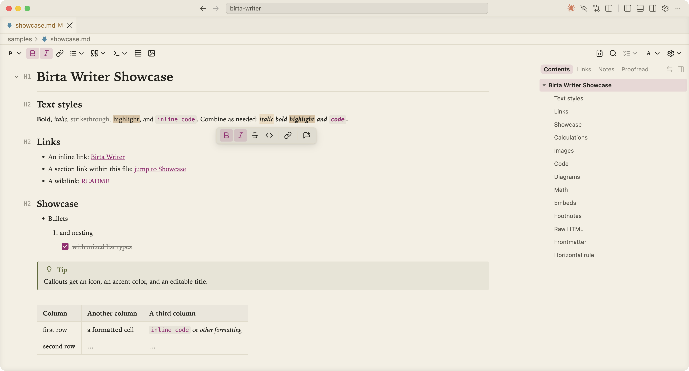
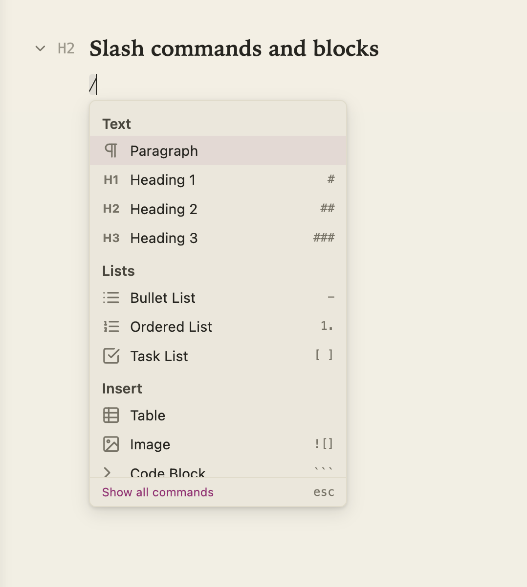
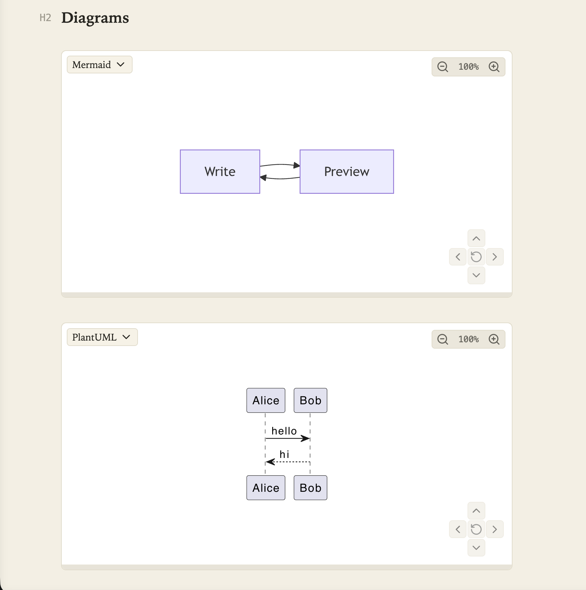
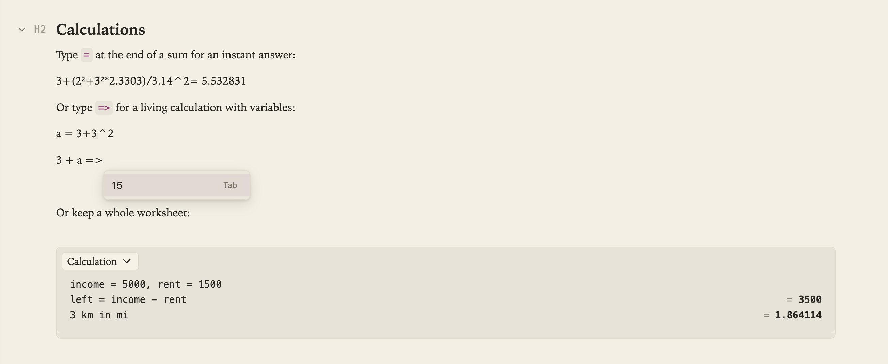
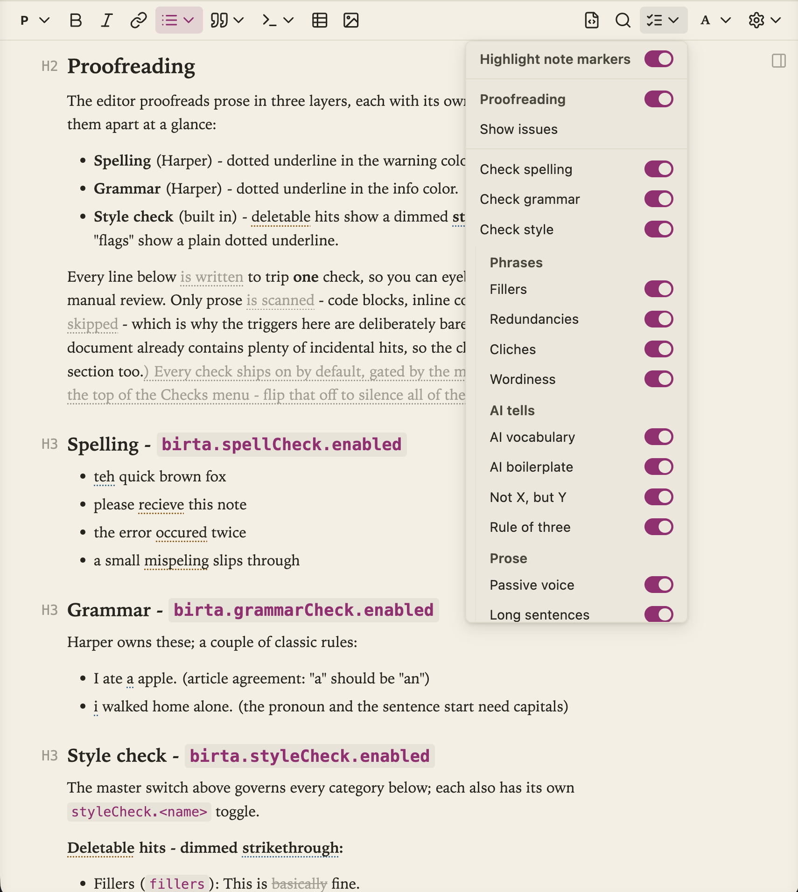

Birta Writer replaces VS Code's split-pane Markdown preview with a modern visual document editor where tables, diagrams, math autocompletions, and more are beautifully rendered. Broad support for content created by other apps, including Obsidian wikilinks, frontmatter, and rich interactive embeds for Figma, Loom, and more.



Birta Writer strives to be your favorite place to write.

1. It's _fast and responsive_, with modern ergonomics like `/` slash menus, draggable blocks, and straightforward tables.
2. _Offline by default_, no tracking of any kind. Your private data stays private.
3. It _won't lose data_ or unexpectedly reformat your file, backed by a minimal-diff engine.
4. Embraces the _many flavors of Markdown_ that people (and tools) actually write. Natively supports Obsidian and Foam wikilinks, `==highlights==`, frontmatter, GitHub callouts, Notion exports, and Logseq outlines.



It fully integrates with everything you'd expect of a VS Code extension, from a vast theme library to your own AI assistant in the sidebar. Pairs well with the [Claude Code extension](https://marketplace.visualstudio.com/items?itemName=anthropic.claude-code), so you can use your Claude subscription instead of API keys.



While Birta Writer's core experience is calm and minimal by default, many powerful features emerge when you need them:

- Opt-in interactive Figma embeds, playable Loom and Youtube videos, and rich link previews.
- Renders Mermaid diagrams, LaTeX, images, inline HTML, and more.
- Autocompletes inline and advanced math:
    - 3+7= `10`
    - 3+log10(2²+3²\*2.3303)/π^2= `3.141593`
    - rent / budget \* 100=> `30` (`=>` adds your own variables and unit conversions)
- Offline proofreading through the [Harper Grammar Library](https://writewithharper.com/docs/rules), extended to highlight common _"AI tells"_. Just because people research and outline with LLMs doesn't mean we have to write like one.
- Editor and revision tools, such as `[TK]`, `TODO`, HTML comments, and user-defined annotation highlighting.
- Customizable display including page width, size, fonts, optional line numbers, and a live/editable table of contents. Safe to ignore, the defaults are intentional and sophisticated.



Everything is deeply customizable through VS Code settings.

Birta Writer in VS Code is a drop-in replacement for any PKM vault (Personal Knowledge Management). It traverses local file links and supports YAML frontmatter metadata.



---

> _birta_ (Icelandic)
>
> To publish and make public, to reveal, to make manifest, to brighten.

---

## Getting started

Install the extension from the [VS Code Marketplace](https://marketplace.visualstudio.com/items?itemName=BirtaLabs.birta-writer) or from [Open VSX](https://open-vsx.org/extension/BirtaLabs/birta-writer), and open any `.md` or `.markdown` file. The first time, you may need to switch from VS Code's editor to Birta Writer manually. After that, Markdown files open automatically. (You can change this behavior in VS Code Settings).

### Basic controls

| Keys                    | Action                                       |
| ----------------------- | -------------------------------------------- |
| `/` at line start       | Slash menu, insert anything                  |
| `Cmd+.`                 | Menu for the current block                   |
| `Esc`, then `Shift+↑/↓` | Select blocks; `Alt+↑/↓` moves them          |
| `Cmd+F`, `Cmd+Alt+F`    | Find, Find & Replace                         |
| `Cmd+Shift+O`           | Go to heading                                |
| `Cmd+Shift+M`           | Toggle Birta Writer ⇄ native editor Markdown |
| _… and many more_       |                                              |

Everything is rebindable in VS Code's Keyboard Shortcuts. See [Features and settings](docs/FEATURES.md) for complete feature reference, settings list, and keyboard shortcuts.

Requires VS Code 1.95 or later.

Also published to [Open VSX](https://open-vsx.org/extension/BirtaLabs/birta-writer), so it appears in the built-in extension search of VSCodium, Cursor, Windsurf, Gitpod and other editors that read that registry.

---

## Support

Run Birta Writer: Send Feedback from the VS Code Command Palette to open a GitHub issue in your browser.

You may also [file an issue directly](https://github.com/harlanlewis/birta-writer/issues).

---

## License & attribution

Birta Writer is by [Harlan Lewis](https://www.harlanlewis.com) at [Birta Labs](https://www.birtalabs.com).

Birta Writer is source-available under the Functional Source License (FSL-1.1-ALv2). See [LICENSE](LICENSE) and [NOTICE](NOTICE).

Every release is signed. The same `.vsix` goes to the Marketplace, to [Open VSX](https://open-vsx.org/extension/BirtaLabs/birta-writer), and to the [GitHub release](https://github.com/harlanlewis/birta-writer/releases), so you can confirm it was built by this repository, from this source:

```bash
gh release download --repo harlanlewis/birta-writer --pattern '*.vsix'
gh attestation verify birta-writer-*.vsix --repo harlanlewis/birta-writer
```
