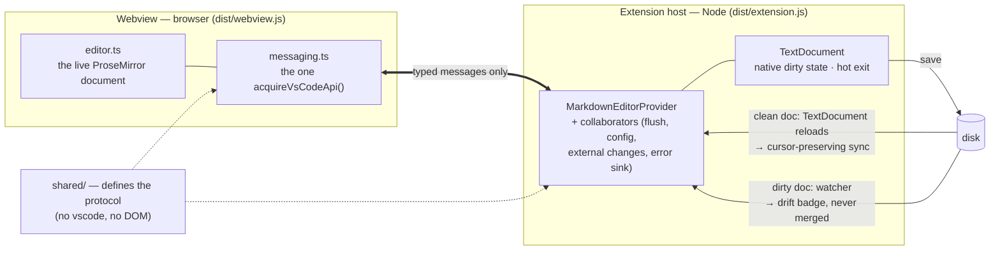
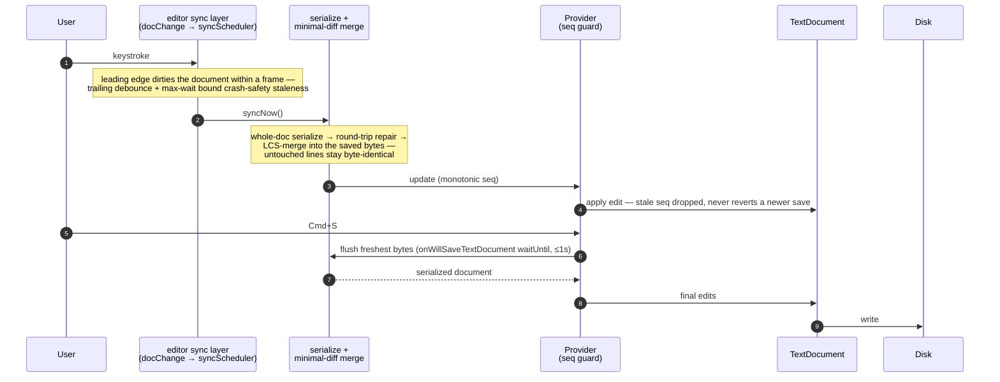
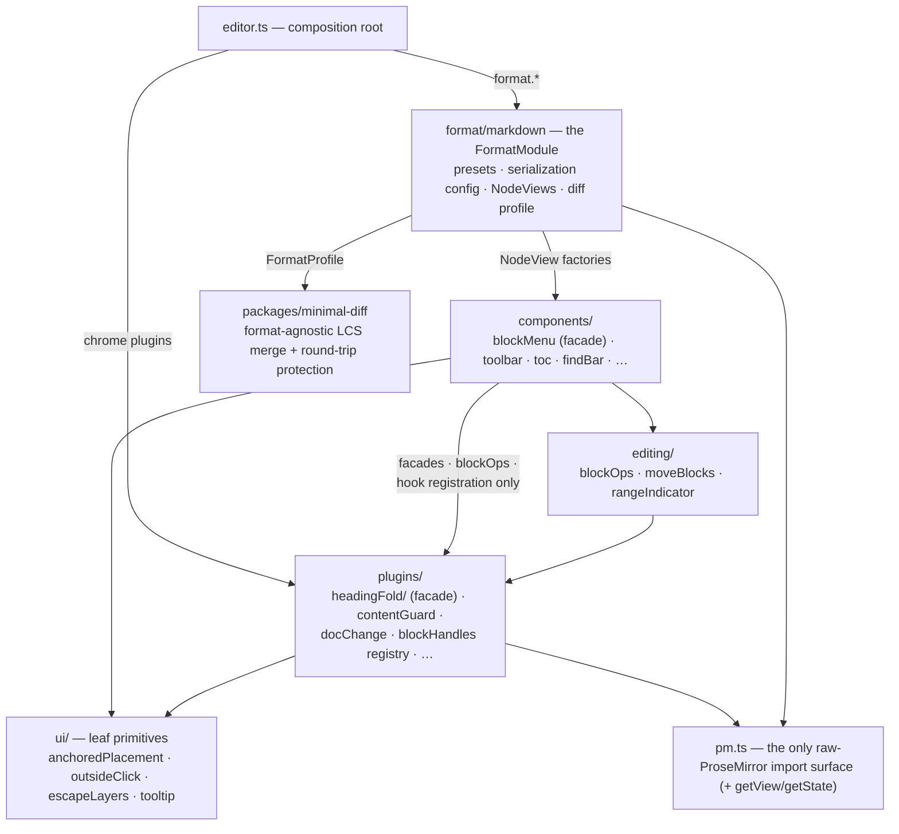

# Architecture

How the editor is built, in three views — for the curious, and as the receipts behind the fidelity claims in [`README.md`](../README.md) and [`BENEFITS.md`](BENEFITS.md). Every boundary drawn here is enforced by a convention test where one is named: the diagrams describe rules the test suite pins, not intentions. (The exhaustive file map lives in [`AGENTS.md`](../AGENTS.md).)

## The system at a glance

Two bundles, one typed protocol. The webview funnels every outbound message through `messaging.ts` (the single `acquireVsCodeApi()` call), the extension through `webviewMessaging.ts`, and both directions are discriminated unions defined once in `shared/` — a directory deliberately free of both `vscode` imports and DOM types so it compiles into either target. Content leaves through the native `TextDocument`, and comes back in through two deliberately separate paths — VS Code never applies a disk write to a *dirty* document, so neither path can cover the other's case (the ADR lives in `src/externalChanges.ts`).

Guards: `typedWebviewSends.test.ts` (no raw `postMessage` outside the funnels), `configDefaultsContributions.test.ts` (every `birta.*` default pinned against `package.json`). The provider's collaborators — `saveFlushController`, `config.ts` (all `birta.*` reads and writes), `externalChanges` + `diskDrift`, `webviewHtml`, `errorSink` — are enumerated in `AGENTS.md`'s key-file map rather than drawn here.

## The save pipeline — why editing one line never rewrites another

This is the product's existential property (see [Why this fork](WHY_THIS_FORK.md)). The edit lives in the webview; the `TextDocument` is what VS Code saves; the pipeline between them serializes the **whole** document but writes only the lines that really changed.

Two properties are pinned hard: a save can never persist content older than the editor state, and the first edit after a save dirties the document within one IPC hop (`AGENTS.md` → *Autosave* has the full invariants; `savePipeline.test.ts` and the integration suite enforce them, and `e2e/syncLatency` pins the scheduler's latencies).

Round-trip **protection** is the second half of fidelity: at load, the document is compared against its own zero-edit serialization; every construct the parser can't reproduce byte-for-byte (setext headings, escaping churn, reference-link styles…) is recorded and repaired back to its saved bytes on every later save — until the user actually edits that construct, at which point the edit wins.

## Webview layering and the format seams

Dependency direction is the rule that keeps the webview refactorable: `ui/` is a leaf, components reach plugin state only through published facades (`plugins/headingFold`'s index, `editing/blockOps`, `components/blockMenu`'s index), and plugins import no components — the one inversion they need (block-menu wiring on fold gutters) is late-bound: blockMenu registers callbacks into a registry the plugin layer owns, so the runtime flow points left while every import still points right.

The same injection shape appears at both seams: the editor consumes a `FormatModule` (`{presets, configureSerialization, nodeViews, formatProfile}` — markdown is format #1), and the minimal-diff engine consumes a `FormatProfile` (`{keyLines, glueChangesConstruct, blankSplitsBlock}` — contextual line identity plus the two blank-line-is-structure predicates). The serializer inside markdown's presets is Milkdown's own, wrapped by `plugins/serializerPostPass.ts` with the format's whole-document post-pass — the one point where the entire serialized document exists, which is what the org-cookie and autolink unescapes need. It used to be a vendored, patched copy of Milkdown's `SerializerState` carrying three fidelity deltas; Milkdown 7.22.0 fixed all three upstream, and all that survives is `priority: 25` on the two link marks (`plugins/linkBoundary.ts`).

Guards: `pmFunnel.test.ts` (no `@milkdown/prose` import outside `pm.ts`), `blockMenuFacade.test.ts` (no deep imports into blockMenu; no component imports under the fold hub).
