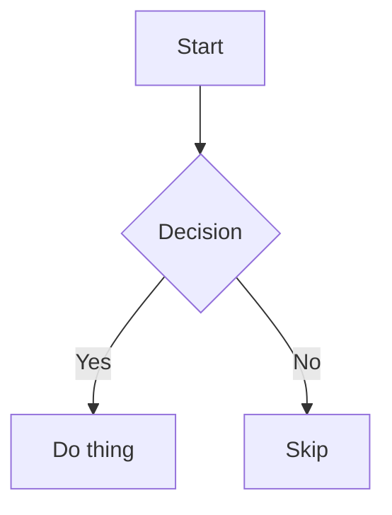

> # Content inventory

This document is a **living reference** of every content type WYSIWYG Markdown Editor supports. Open it directly in the editor to eyeball how each type renders across themes and fonts. When we add support for a new content type, add an example here; when we drop or change one, update it. Keep the "Not yet supported" section honest — move items up into the body as they land.

---

## Headings

# Heading 1

## Heading 2

### Heading 3

#### Heading 4

##### Heading 5

###### Heading 6

Setext headings round-trip in their original form too:

# Setext H1

## Setext H2

---

## Inline text

The supported inline text styles are **bold**, _italic_, **_bold italic_**, ~~strikethrough~~, and `inline code`. That is the complete set — Markdown has no underline, highlight, superscript, or subscript (those need raw HTML, which renders read-only).

Styles nest: **bold wrapping `code`**, _italic wrapping a [link](https://example.com)_, and ~~struck-through **bold**~~.

A hard line break ends this line here →<br>and continues on the next.

(Links, inline math, and footnotes are inline too — see their own sections.)

---

## Links

- Inline link: [WYSIWYG Markdown Editor](https://example.com)
- Link with a title: [hover me](https://example.com "A title")
- Formatted link text stays one link: [**bold** and `code` tail](https://example.com)
- Autolink: <https://example.com>
- Reference link (full): [see the spec][spec]
- Reference link (collapsed): [spec][]
- Reference link (shortcut): [spec]

[spec]: https://example.com/spec "Reference definition"

---

## Lists

### Bullet list

- First item
- Second item
    - Nested item
    - Another nested item
- Third item with `code` and a [link](https://example.com)

### Ordered list

1. First step
2. Second step
    1. Sub-step a
    2. Sub-step b
3. Third step

### Task list

- [ ] Incomplete task
- [x] Completed task
- [ ] Task with **formatting** and a [link](https://example.com)

---

## Blockquotes

> A single-line blockquote.

> A multi-line blockquote
> that spans several lines,
> and can contain **formatting** and `code`.

---

## Code blocks

Fenced code block with syntax highlighting:

```js
function greet(name) {
    return `Hello, ${name}!`;
}
```

```python
def greet(name: str) -> str:
    return f"Hello, {name}!"
```

Plain fenced block (no language):

```
no highlighting here
```

---

## Tables

| Feature     | Supported | Notes                           |
| ----------- | :-------: | ------------------------------- |
| Alignment   |    yes    | left / center / right           |
| Formatting | yes | **bold**, *italics*, `code`, [links][spec] |
| Line breaks |    yes    | first line<br>second line       |

---

## Math

Inline math renders in place: $E = mc^2$. Currency like $5 and $10 stays as
plain text.

Block math:

$$
\int_0^1 x^2 \, dx = \frac{1}{3}
$$

---

## Footnotes

A sentence with a footnote reference.[^note] Footnotes are auto-numbered and their definitions round-trip.

[^note]: The footnote definition, with a second sentence for good measure.

---

## Images

Inline image (replace with a real path to see it render):


---

## Diagrams (Mermaid)

Rendered with preview / zoom / pan; round-trips as a plain fenced `mermaid` block.



---

## Horizontal rules

Three marker styles all round-trip in their original form:

---

---

---

---

## Raw HTML

Inline and block HTML render as a sanitized, read-only preview (editing raw HTML requires the source editor):

<div align="center"><strong>Centered raw HTML block</strong></div>

An HTML comment preserved and shown dimmed:

<!-- This is a comment. It survives round-trips. -->

---

## Frontmatter

See the top of this file — YAML frontmatter is lossless. Flat key/value pairs
get a table UI; complex/nested YAML preserved verbatim.

---

## Not supported

If and when support lands for these common content types, move up into the body of this document with a real example.

### Callouts

Callouts in the GitHub and Obsidian style parse as an ordinary blockquote whose first line is the literal `[!NOTE]` text.

> [!NOTE] Hello

> [!WARNING] Hello

### Videos / embeds

No `<video>` / `<iframe>` handling; such tags fall through to the read-only sanitized HTML preview (and iframes are stripped).

### Definition lists

`term` / `: definition` syntax is not parsed.
