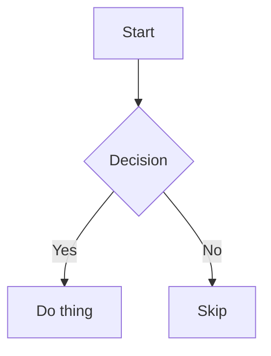

# Content inventory

This document is a **living reference** of every content type WYSIWYG Markdown Editor supports. Open it directly in the editor to eyeball how each type renders across themes and fonts. When we add support for a new content type, add an example here; when we drop or change one, update it. Keep the "Not yet supported" section honest — move items up into the body as they land.

---

## Headings

# Heading 1

## Heading 2

### Heading 3

#### Heading 4

##### Heading 5

###### Heading 6

Setext headings round-trip in their original form too:

# Setext H1

## Setext H2

---

## Inline text

The supported inline text styles are **bold**, _italic_, _**bold italic**_, ~~strikethrough~~, ==highlight==, and `inline code`.

Styles nest: **bold wrapping `code`**, _italic wrapping a [link](https://example.com)_, and ~~struck-through **bold**~~.

### Highlight

`==text==` renders as a ==highlight== (Obsidian syntax). Typing `==text==` applies it live; a Highlight command lives in the palette, and an opt-in toolbar button ships hidden by default. The grammar is deliberately strict — each of these stays plain text, byte-preserved:

- spaces at the edges: == spaced ==
- an `=` inside: ==a=b==
- no closer: 2==2

(One rejected form per line: adjacent forms on a single line can
legitimately cross-match, the tail `==` of one pairing with the head of the
next — the same behavior as any paired-delimiter syntax.) Nested formatting
inside a highlight renders literally.

A hard line break ends this line here →<br>and continues on the next.

---

## Links

- Inline link: [WYSIWYG Markdown Editor](https://example.com)
- Link with a title: [hover me](https://example.com "A title")
- Formatted link text stays one link: [**bold** and `code` tail](https://example.com)
- Autolink: <https://example.com>
- Reference link (full): [see the spec][spec]
- Reference link (collapsed): [spec][]
- Reference link (shortcut): [spec]

[spec]: https://example.com/spec "Reference definition"

Hover any link for the popup: it shows **where the link actually opens**
(`→ path`, straight from the resolver), an open button (or Cmd/Ctrl+click the
link itself), and a pencil to edit — text, URL, and a **format switch**
(`markdown` ⇄ `[[wiki]]`) that converts the link in place. Edits **save on
blur**; there is no confirm button. External links open through VS Code's own
trusted-domains prompt.

### Smart local links

With `markdownWysiwyg.smartLinks` (default on) local links resolve the way a
site generator publishes them — every link below opens a real file in this
repo when clicked:

- Workspace-root path, extension inferred: [the README](/README)
- Nested root path: [custom themes](/docs/en/custom-themes)
- Document-relative, `..` and suffix inference: [changelog](../CHANGELOG)
- `@/` workspace prefix: [package manifest](@/package.json)
- Heading fragment (scrolls after opening): [README → Features](../README.md#features)
- Line-number fragment: [README line 24](../README.md#24)
- A miss shows a quiet warning: [no such page](/write/nonexistent)

---

## Wikilinks

Obsidian-style wikilinks parse, navigate, and round-trip **byte-identically**.
Typing `[[` opens file-name autocompletion. Bare names match by filename
across the workspace:

- Bare name: [[README]]
- With an alias: [[custom-themes|the theming guide]]
- To a heading in another file: [[README#Features]]
- Same-page heading: [[#wikilinks]]
- Colon in a title is just a title, never a URL scheme: [[note: plan]]
- Citation shape stays a normal CommonMark link, never a wikilink: [[1]](https://example.com)

In a table cell the alias pipe is escaped (`\|`), and it still reads as one
cell:

| form | rendered |
|---|---|
| escaped alias | [[custom-themes\|aliased]] |

---

## Lists

### Bullet list

- First item

- Second item

    - Nested item
    - Another nested item

- Third item with `code` and a [link](https://example.com)

### Ordered list

1. First step
2. Second step

    1. Sub-step a
    2. Sub-step b
3. Third step

### Task list

- [ ] Incomplete task
- [x] Completed task
- [ ] Task with **formatting** and a [link](https://example.com)

---

## Blockquotes

> A single-line blockquote.

> A multi-line blockquote
> that spans several lines,
> and can contain **formatting** and `code`.

---

## Callouts

GitHub alerts and Obsidian callouts render with a per-kind icon and accent
color. The icon is a button — click it (or Enter/Space when focused) to
switch the kind; the title text is editable in place (Enter or click away
saves, Escape reverts). The marker line's exact source bytes round-trip.

> [!NOTE]
> The five GitHub types: NOTE, TIP, IMPORTANT, WARNING, CAUTION.

> [!TIP]
> Green, with a lightbulb.

> [!IMPORTANT]
> Purple, for the load-bearing stuff.

> [!WARNING]
> Yellow triangle.

> [!CAUTION]
> Red octagon.

> [!note] Obsidian style with an editable title
> Lowercase types and titles are the Obsidian convention.

> [!faq] Aliases resolve
> `faq`/`help` → question, `hint` → tip, `error` → danger, `tldr` → abstract…

> [!tip]- A folded callout (click the chevron)
> Folding is **visual only** — expanding/collapsing never edits the file.
> `[!tip]-` starts collapsed, `[!tip]+` starts open.

> [!success] Callouts nest
> Outer body.
>
> > [!bug] Inner callout
> > With its own kind and accent.

> [!custom-kind] Unknown types are kept
> Styled neutrally, raw type preserved verbatim.

Deliberate degradations (still byte-preserved, render as plain blockquotes):
a marker line with inline **formatting**, or an escaped marker:

> [!WARNING] a **formatted** title stays a plain blockquote

> \[!NOTE] an escaped marker stays a plain blockquote

### Notion export asides

Notion's markdown export writes callouts as `<aside>` HTML ("there is no
Markdown equivalent" — Notion's own docs). The emoji maps to an accent
color, the body is fully editable markdown, and the exact byte shape
round-trips:

<aside>
💡 A Notion callout: emoji icon, editable body, **markdown inside**.

</aside>

<aside>
⚠️ Warning emoji → warning accent. Unknown emoji or none → neutral.

</aside>

The ``-icon variant and unclosed asides stay as the read-only
sanitized HTML preview, byte-preserved.

---

## Container directives

`:::name` fenced blocks (the Docusaurus admonition syntax) render as labeled
containers with an editable body and title. Known names pick up callout-style
accents; `{attrs}` are preserved raw; `::::` nests. Typing `:::name ` in an
empty paragraph creates one.

:::note
A basic directive. The body is ordinary editable markdown: **bold**, `code`,
[links](https://example.com), lists…
:::

:::tip An editable title
Click the title in the header to edit it.
:::

:::info{title="Attributes survive"}
The `{…}` block never renders, but round-trips byte-identically.
:::

::::danger Nesting
Outer body.

:::note Inner
Fewer colons inside more colons.
:::

::::

An unclosed fence deliberately stays ordinary text:

:::unclosed
this line and the fence above render as plain paragraphs.

---

## Code blocks

Fenced code block with syntax highlighting:

```js
function greet(name) {
    return `Hello, ${name}!`;
}
```

```python
def greet(name: str) -> str:
    return f"Hello, {name}!"
```

Plain fenced block (no language):

```
no highlighting here
```

---

## Tables

| Feature | Supported | Notes |
|---|:---:|---|
| Alignment | yes | left / center / right |
| Formatting | yes | **bold**, *italics*, `code`, [links][spec] |
| Line breaks | yes | first line<br>second line |

---

## Math


Inline math renders in place: $E = mc^2$. Currency like $5 and $10 stays as
plain text.

Block math:

$$
\int_0^1 x^2 \, dx = \frac{1}{3}
$$

---

## Footnotes

A sentence with a footnote reference.[^note] Footnotes are auto-numbered and their definitions round-trip.

[^note]: The footnote definition, with a second sentence for good measure.

---

## Images

Inline image with a relative path and a title. The alt text is the editable
caption under the image (revealed on selection when empty); the title is the
hover tooltip, as in published HTML. Click the image for the toolbar — a
file-name chip that edits the path (autocompletes workspace images), zoom,
delete, and the editable title on its own row. Edits apply on Enter or
click-away, Escape cancels.


---

## Diagrams (Mermaid)

Rendered with preview / zoom / pan; round-trips as a plain fenced `mermaid` block.



---

## Horizontal rules

Three marker styles all round-trip in their original form:

---

---

---

---

## Raw HTML

Inline and block HTML render as a sanitized, read-only preview (editing raw HTML requires the source editor):

<div align="center"><strong>Centered raw HTML block</strong></div>

An HTML comment preserved and shown dimmed:

<!-- This is a comment. It survives round-trips. -->

---

## Frontmatter

See the top of this file — YAML frontmatter is lossless. Flat key/value pairs
get a table UI; complex/nested YAML preserved verbatim.

---

## Not supported

If and when support lands for these common content types, move up into the body of this document with a real example.

### Videos / embeds

No `<video>` / `<iframe>` handling; such tags fall through to the read-only sanitized HTML preview (and iframes are stripped).

### Wikilink embeds

Obsidian's transclusion form `![[page]]` is not treated as an embed — it renders as a literal `!` followed by an ordinary wikilink chip, and round-trips untouched (MAR-45): ![[image-target]]

### Emoji shortcodes

`:smile:` stays literal text; a byte-preserving renderer is under consideration (MAR-46).

### Definition lists

`term` / `: definition` syntax is not parsed. parked with sub/superscript, `%%comments%%`, `[TOC]`, and `#tags`. Under consideration (MAR-47)
