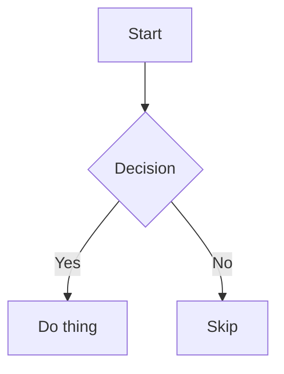

# Content inventory

This document is a **living reference** of every content type Birta Writer supports. Open it directly in the editor to eyeball how each type renders across themes and fonts. When we add support for a new content type, add an example here; when we drop or change one, update it. Keep the "Not yet supported" section honest — move items up into the body as they land.

---

---

---

## Headings

# Heading 1

A line of content under a Heading 1.

## Heading 2

A line of content under a Heading 2.

### Heading 3

A line of content under a Heading 3.

#### Heading 4

A line of content under a Heading 4.

##### Heading 5

A line of content under a Heading 5.

###### Heading 6

A line of content under a Heading 6.

Setext headings round-trip in their original form too (these two are real
setext source — open the raw file to confirm saving never rewrites them to
`#` form):

Setext H1
=========

Setext H2
---------

---


---

---

---

## Inline text

The supported inline text styles are **bold**, _italic_, _**bold italic**_, ~~strikethrough~~, ==highlight==, and `inline code`.

Styles nest: **bold wrapping `code`**, _italic wrapping a [link](https://example.com)_, and ~~struck-through **bold**~~.

### Inline calculator

Start or end a math equation with `=` to automatically compute it. For example, `5+7^4-1=` or `=32+7`

Put the caret at the end of any line below and press `=` to try it:

12 * 4

(3 + 4) / 2

10 % 3

2 ^ 10

-2 ^ 2

The answer appears as a suggestion — confirm with **Tab** (Return stays a newline), or pick "Always insert result" in the menu (also the **Toggle Calc Auto-Insert** palette command, `birta.calc.autoInsert`) to have every future trailing `=` answered instantly; the `=`-before form always stays a suggestion, since you may still be typing digits. The result inserts as plain text, so nothing calc-specific ever persists in the file.

What it refuses: `1,000,000 / 3 =` offers nothing (evaluating the fragment after the comma would be a *wrong* answer), and `total = 2 + x` never triggers (letters aren't arithmetic) — same reason `=5+7` typed as `a=5+7` stays prose. A pure digits-and-operators run always computes, though — `2026-07-17 =` answers `2002`, chained subtraction, because the suggestion is yours to decline.

### Living calculations (`=>`)

Ending an expression with `=>` unlocks the richer form: **named variables**
defined earlier in the document as `name = value` lines (only definitions
*above* the cursor count, read top-to-bottom), and **offline unit conversions**
with `in` / `to` across the full mathjs unit catalog — length, mass, time,
volume, temperature, area, data, and more. Same Tab-confirmed suggestion, same
plain-text insert; expressions are evaluated by the same eval-free offline
engine, and the unit catalog never sees them (currency is deliberately absent
— live rates would need the network).

budget = 5000

rent = 1500

Try `=>` at the end of any line below:

rent / budget * 100 =>

budget - rent =>

3 km in mi =>

180 lb to kg =>

log10(4/3 * pi) =>

sqrt(2) * π =>

budget² - rent² =>

Accepted `=>` answers stay **alive**: edit the expression — or a definition
above it — and the number updates in place. Editing the answer itself is your
override; the editor never fights it. Try it: change `rent = 1500` above after
accepting a result below.

Both inline forms live under `birta.calc.enabled`. Fragments are never
computed: `1,000 + 2 =>` offers nothing rather than answering the digits after
the comma, and results display at most 6 decimals — an answer, not noise.

### Highlight

`==text==` renders as a ==highlight== (Obsidian syntax). Typing `==text==` applies it live; a Highlight command lives in the palette, and an opt-in toolbar button ships hidden by default. The grammar is deliberately strict — each of these stays plain text, byte-preserved:

- spaces at the edges: == spaced ==
- an `=` inside: ==a=b==
- no closer: 2==2

(One rejected form per line: adjacent forms on a single line can
legitimately cross-match, the tail `==` of one pairing with the head of the
next — the same behavior as any paired-delimiter syntax.) Nested formatting
inside a highlight renders literally.

A hard line break ends this line here →<br>and continues on the next.


---

---

---

## Links

- Inline link: [Birta Writer](https://example.com)
- Link with a title: [hover me](https://example.com "A title")
- Formatted link text stays one link: [**bold** and `code` tail](https://example.com)
- Autolink: <https://example.com>
- Reference link (full): [see the spec][spec]
- Reference link (collapsed): [spec][]
- Reference link (shortcut): [spec]

[spec]: https://example.com/spec "Reference definition"

Hover a link for the popup (clicking pins it open): it shows **where the link
actually opens** (`→ path`, straight from the resolver) and the actions
`open · copy · unlink · edit` — editing covers text, URL, and (for local
links) a **Local link format** switch (`markdown` ⇄ `[[wiki]]`) that converts
the link in place. Edits **save on blur**; there is no confirm button.
External links open through VS Code's own trusted-domains prompt, or
Cmd/Ctrl+click the link itself.

### Smart local links

With `birta.smartLinks` (default on) local links resolve the way a
site generator publishes them — every link below opens a real file in this
repo when clicked:


- Workspace-root path, extension inferred: [the README](/README)
- Nested root path: [the perf harness](/e2e/perf/README)
- Document-relative, `..` and suffix inference: [changelog](../CHANGELOG)
- `@/` workspace prefix: [package manifest](@/package.json)
- Heading fragment (scrolls after opening): [README → Features](../README.md#features)
- Line-number fragment: [README line 24](../README.md#24)
- A miss shows a quiet warning: [no such page](/write/nonexistent)

---

### Wikilinks

Obsidian-style wikilinks parse, navigate, and round-trip **byte-identically**.
Typing `[[` opens file-name autocompletion. Bare names match by filename
across the workspace:

- Bare name: [[README]]
- With an alias: [[CHANGELOG|the changelog]]
- To a heading in another file: [[README#Features]]
- Same-page heading: [[#wikilinks]]
- Colon in a title is just a title, never a URL scheme: [[note: plan]]
- Citation shape stays a normal CommonMark link, never a wikilink: [[1]](https://example.com)

In a table cell the alias pipe is escaped (`\|`), and it still reads as one
cell:

| form | rendered |
|---|---|
| escaped alias | [[CHANGELOG\|aliased]] |

---

### URL embeds

A bare YouTube link on its own line renders as an inline player card — a static thumbnail with a play button that loads the actual player (privacy-mode `youtube-nocookie.com`) only when you click it. The card is **render-only**: the stored source stays the plain link below, so the file round-trips byte-for-byte, and clicking into the line reveals the raw URL to edit.

https://www.youtube.com/watch?v=dQw4w9WgXcQ

Only known providers embed — **YouTube is the only provider today** (more are tracked in Linear). Anything else stays an ordinary link, even on its own line, and a labeled `[text](url)` link is never carded:

<https://github.com/harlanlewis/birta-writer/>

https://vimeo.com/76979871

[watch this](https://www.youtube.com/watch?v=dQw4w9WgXcQ)

Embeds are network features and are **off by default** — with `birta.network.enabled` off the lines above are ordinary links; turn the master switch on (Cmd+Shift+P → "Toggle Network Features", or accept the inline prompt) and reopen the file to see the cards.

---

---

---

## Lists

### Bullet list

- First item
- Second item
  - Nested item
  - Another nested item
    - Deeply nested item
      - Even more deeply nested item

- Third item with `code` and a [link](https://example.com)


### Ordered list

1. First step
2. Second step

   1. Sub-step a
   2. Sub-step b
      1. Deeply nested step
         1. Even more deeply nested step
3. Third step

### Task list

- [ ] Incomplete task
- [x] Completed task
- [ ] Task with **formatting** and a [link](https://example.com)

---

---

---

## Quotes

### Blockquotes

> A single-line blockquote.

> A multi-line blockquote that spans several lines and can contain
> **formatting** and `code` — long enough to wrap at any sane editor width,
> so soft-wrap rendering inside a quote gets eyeballed here too.
>
> A second paragraph inside the same quote.

---

### Callouts

GitHub alerts and Obsidian callouts render with a per-kind icon and accent
color. The icon is a button — click it (or Enter/Space when focused) to
switch the kind; the title text is editable in place (Enter or click away
saves, Escape reverts). The marker line's exact source bytes round-trip.


> [!NOTE]
> The five GitHub types: NOTE, TIP, IMPORTANT, WARNING, CAUTION.

> [!TIP]
> Green, with a lightbulb.

> [!IMPORTANT]
> Purple, for the load-bearing stuff.

> [!WARNING]
> Yellow triangle.

> [!CAUTION]
> Red octagon.

> [!note] Obsidian style with an editable title
> Lowercase types and titles are the Obsidian convention.

> [!faq] Aliases resolve
> `faq`/`help` → question, `hint` → tip, `error` → danger, `tldr` → abstract…

> [!tip]- A folded callout (click the chevron)
> Folding is **visual only** — expanding/collapsing never edits the file.
> `[!tip]-` starts collapsed, `[!tip]+` starts open.

> [!success] Callouts nest
> Outer body.
>
> > [!bug] Inner callout
> > With its own kind and accent.

> [!custom-kind] Unknown types are kept
> Styled neutrally, raw type preserved verbatim.

Deliberate degradations (still byte-preserved, render as plain blockquotes):
a marker line with inline **formatting**, or an escaped marker:

> [!WARNING] a **formatted** title stays a plain blockquote

> \[!NOTE] an escaped marker stays a plain blockquote

#### Notion export asides

Notion's markdown export writes callouts as `<aside>` HTML ("there is no
Markdown equivalent" — Notion's own docs). The emoji maps to an accent
color, the body is fully editable markdown, and the exact byte shape
round-trips:

<aside>
💡 A Notion callout: emoji icon, editable body, **markdown inside**.

</aside>

<aside>
⚠️ Warning emoji → warning accent. Unknown emoji or none → neutral.

</aside>

The ``-icon variant and unclosed asides stay as the read-only
sanitized HTML preview, byte-preserved.

---

#### Container directives

`:::name` fenced blocks (the Docusaurus admonition syntax) render as labeled
containers with an editable body and title. Known names pick up callout-style
accents; `{attrs}` are preserved raw; `::::` nests. Typing `:::name ` in an
empty paragraph creates one.

:::note
A basic directive. The body is ordinary editable markdown: **bold**, `code`,
[links](https://example.com), lists…
:::

:::tip An editable title
Click the title in the header to edit it.
:::

:::info{title="Attributes survive"}
The `{…}` block never renders, but round-trips byte-identically.
:::

::::danger Nesting
Outer body.

:::note Inner
Fewer colons inside more colons.
:::

::::

An unclosed fence deliberately stays ordinary text:

:::unclosed
this line and the fence above render as plain paragraphs.

---

---

---

## Tables

| Feature | Supported | Notes |
|---|:---:|---|
| Formatting | yes | **bold**, *italics*, `code`, [links][spec] |
| Line breaks | yes | first line<br>second line |
| Alignment | yes | right-click a cell → **Align Column Left / Center / Right** (this Supported column is `:---:` centered); re-pick the current alignment to clear back to `---` |

---

---

---

## Images

Inline image with a relative path and a title. The alt text is the editable
caption under the image (revealed on selection when empty); the title is the
hover tooltip, as in published HTML. Click the image for the toolbar — a
file-name chip that edits the path (autocompletes workspace images), zoom,
delete, and the editable title on its own row. Edits apply on Enter or
click-away, Escape cancels.


---

---

---

## Code blocks

### Code

Fenced code block with syntax highlighting:

```js
function greet(name) {
    return `Hello, ${name}!`;
}
```

```python
def greet(name: str) -> str:
    return f"Hello, {name}!"
```

Plain fenced block (no language):

```
no highlighting here
```

### Diagrams (Mermaid)

Rendered with preview / zoom / pan; round-trips as a plain fenced `mermaid` block.



### Calc blocks

A fenced `calc` block is a live worksheet (insert from the slash menu's **Calc
Block**): every line computes under one shared, top-to-bottom scope, shown in a
selectable source/value ledger that recomputes as you type. The source is never
rewritten — the block round-trips byte-for-byte, and toggling to code shows
exactly what you typed. A line that *reads* as a formula but can't compute (the
`typo * 2` below — an unknown name) shows a quiet dimmed dash; plain prose and
comments stay silent. Own switch: `birta.calc.blocks.enabled`, independent of
the inline calculators.

```calc
# a tiny budget worksheet
income = 5000
rent = 1500
food = 800
total = rent + food
left = income - total
share = rent / income * 100
3 km in mi
typo * 2
```

---

---

---

### Math

Inline math renders in place and is **edited in place**: arrow into
$E = mc^2$ and the rendered formula reveals its raw LaTeX for per-character
editing, exactly like inline code; leave it and KaTeX re-renders. Currency
like $5 and $10 stays as plain text.

Block math:

$$
\int_0^1 x^2 \, dx = \frac{1}{3}
$$


## Frontmatter

See the top of this file — YAML frontmatter is lossless. Flat key/value pairs
get a table UI; complex/nested YAML preserved verbatim.

---

---

---

## Footnotes

A sentence with a footnote reference.[^note] Footnotes are auto-numbered and their definitions round-trip.

[^note]: The footnote definition, with a second sentence for good measure.

---

---

---

---

## Horizontal rules

Three marker styles, all preserved in their original form on save (open the
raw file: these really are three different markers):

---

***

___

---

## Raw HTML

Inline and block HTML render as a sanitized, read-only preview (editing raw HTML requires the source editor):

<div align="center"><strong>Centered raw HTML block</strong></div>

An HTML comment preserved and shown dimmed:

<!-- This is an HTML comment. It survives round-trips. -->

---

---

---

## Proofreading

The editor proofreads prose in three layers, each with its own decoration so
you can tell them apart at a glance:

- **Spelling** (Harper) — dotted underline in the warning color.
- **Grammar** (Harper) — dotted underline in the info color.
- **Style check** (built in) — deletable hits show a dimmed **strikethrough**;
  judgment-call "flags" show a plain dotted underline.

Every line below is written to trip **one** check, so you can eyeball its
decoration during manual review. Only prose is scanned — code blocks, inline
code, links, and paths are skipped — which is why the triggers here are
deliberately bare words. (The rest of this document already contains plenty of
incidental hits, so the checker lights up outside this section too.) Every check
ships on by default, gated by the master **Proofreading** switch at the top of
the Checks menu — flip that off to silence all of them at once.

### Spelling — `birta.spellCheck.enabled`

- teh quick brown fox
- please recieve this note
- the error occured twice
- a small mispeling slips through

### Grammar — `birta.grammarCheck.enabled`

Harper owns these; a couple of classic rules:

- I ate a apple. (article agreement: "a" should be "an")
- i walked home alone. (the pronoun and the sentence start need capitals)

### Style check — `birta.styleCheck.enabled`

The master switch above governs every category below; each also has its own
`styleCheck.<name>` toggle.

**Deletable hits — dimmed strikethrough:**

- Fillers (`fillers`): This is basically fine.
- Redundancies (`redundancies`): The end result looked great. (only "end" is struck)
- Clichés (`cliches`): Let's grab the low-hanging fruit.
- Wordiness (`wordiness`): There is a faster way to do this.
- AI vocabulary (`aiVocabulary`): Let's delve into the details.
- AI artifacts (`aiArtifacts`): I hope this helps.
- Repeated words (`repeated`, part of the master switch): We shipped the the fix. (the second "the" is struck)

**Judgment flags — dotted underline:**

- Long sentences (`longSentences`): This lengthy sentence keeps adding clause after clause with ordinary words and no other traps at all, purely so that it sails past the thirty word limit that the sentence length checker quietly watches for during review.
- Rule of three (`ruleOfThree`): The build is fast, cheap, and reliable.
- Em dash (`emDash`): The plan is simple — ship it. (offers an ASCII fix)
- Non-ASCII punctuation (`nonAsciiPunct`): She called it “clever,” then trailed off… (curly quotes and an ellipsis glyph)
- Passive voice (`passive`): The report was written overnight.
- Negative parallelism (`negativeParallelism`): It's not a bug, it's a feature.

---

---

---

## Editor notes

The **Notes** tab in the review sidebar collects the editor-note markers you
leave for yourself while drafting — the scaffolding that should never survive
into the finished piece. Every marker below is plain text that round-trips
byte-for-byte; the sidebar only *lists* them (click to jump), it never decorates
the prose. Open the Notes tab to see these grouped by type.

- A bare placeholder: [TK] — the classic "to come" mark for a fact you'll fill in later.
- A placeholder carrying its spec: [TK: cite the 2024 remote-work survey] — the bracketed text becomes the note's label.
- A colon marker: TODO: tighten this paragraph before publish.
- A fix marker: FIXME: the figures in this draft are from an old export.
- The bracketed forms work too — [TODO] and [FIXME: broken cross-reference] — and map to the same kinds.
- An HTML comment is a note, and a leading keyword routes it: <!-- TODO: verify these against the current style guide -->

A bare comment with no keyword is just a **Note**: <!-- reminder: the intro still needs a hook -->

Add your own tokens with `birta.notes.customMarkers` — a plain word like
`DRAFT` matches only as a whole word, so it never lights up inside `redrafted`.

---

---

---

## Not supported

> [!WARNING]
> If and when support lands for these common content types, move up into the body of this document with a real example.

### Raw `<video>` / `<iframe>` tags

Raw `<video>` / `<iframe>` HTML tags aren't rendered as players — they fall through to the read-only sanitized HTML preview (iframes are stripped). A bare **YouTube link** on its own line does render as a player card, though — see **URL embeds** above.

### Wikilink embeds

Obsidian's transclusion form `![[page]]` is not treated as an embed — it renders as a literal `!` followed by an ordinary wikilink chip, and round-trips untouched (MAR-45): ![[image-target]]

### Emoji shortcodes

`:smile:` stays literal text; a byte-preserving renderer is under consideration (MAR-46).

### Definition lists

`term` / `: definition` syntax is not parsed. Parked with sub/superscript, `%%comments%%`, `[TOC]`, and `#tags`. Under consideration (MAR-47)
