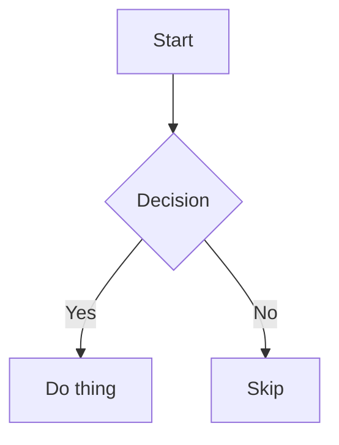
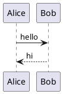
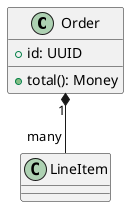
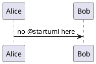
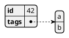
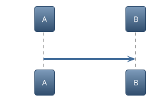
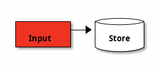

# Content inventory

Every content type Birta Writer supports has an example here. So does every edge case, deliberate rejection form, and expected-failure state, which is what makes this file a regression fixture: the unit-test corpus round-trips its body verbatim. For a quick scroll-through, one clean example per type and none of the fine print, open [the showcase](showcase.md) instead.

When support for a new content type lands, add an example here *with its edge cases*; when one changes, update it. Keep the "Not yet supported" section honest - move items up into the body as they land.

---

## Headings

# Heading 1

A line of content under a Heading 1.

## Heading 2

A line of content under a Heading 2.

### Heading 3

A line of content under a Heading 3.

#### Heading 4

A line of content under a Heading 4.

##### Heading 5

A line of content under a Heading 5.

###### Heading 6

A line of content under a Heading 6.

#### A closed ATX heading ####

The trailing hashes above are the "closed" ATX form - they survive the round trip too.

Setext headings round-trip in their original form too (these two are real setext source - open the raw file to confirm saving never rewrites them to `#` form):

Setext H1
=========

Setext H2
---------

---

## Inline text

The supported inline text styles are **bold**, _italic_, _**bold italic**_, ~~strikethrough~~, ==highlight==, and `inline code`.

Styles nest: **bold wrapping `code`**, _italic wrapping a [link](https://example.com)_, and ~~struck-through **bold**~~.

### Marker fidelity

The emphasis marker you type is part of the bytes: *single stars*, _single underscores_, **double stars**, and __double underscores__ each keep their authored marker on save. Intraword star emphasis works - un*bel*ievable - and typing arithmetic like `60*60*1000` never italicizes it (the star input rule is math-aware; the expression stays in backticks here because as raw source bytes CommonMark would read those stars as emphasis).

### Highlight

`==text==` renders as a ==highlight== (Obsidian syntax). Typing `==text==` applies it live; a Highlight command lives in the palette, and an opt-in toolbar button ships hidden by default. The grammar is deliberately strict - each of these stays plain text, byte-preserved:

- spaces at the edges: == spaced ==
- an `=` inside: ==a=b==
- no closer: 2==2

(One rejected form per line: adjacent forms on a single line can legitimately cross-match, the tail `==` of one pairing with the head of the next - the same behavior as any paired-delimiter syntax.) Nested formatting inside a highlight renders literally.

### Hard line breaks

All three hard-break spellings work. The `<br>` and backslash forms keep their authored bytes outright; the two-trailing-spaces form is kept on lines you don't touch (editing that line re-serializes the break in the backslash form - the spaces are invisible, so the editor can't promise more):

An HTML break ends this line here →<br>and continues on the next.

A backslash break ends this line here →\
and continues on the next.

A two-trailing-spaces break ends this line here →  
and continues on the next.

---

## Inline calculations

### Inline calculator `=`

Start or end a math equation with `=` to automatically compute it. For example, `5+7^4-1=` or `=32+7`

***Add `=` to the end of any line below to try it:***

12 * 4

(3 + 4) / 2

10 % 3

2 ^ 10

-2 ^ 2

The answer appears as a suggestion - confirm with **Tab** (Return stays a newline), or pick "Always insert result" in the menu (also the **Toggle Calc Auto-Insert** palette command, `birta.calc.autoInsert`) to have every future trailing `=` answered instantly; the `=`-before form always stays a suggestion, since you may still be typing digits. The result inserts as plain text, so nothing calc-specific ever persists in the file.

Functions and constants count as arithmetic here: `3+log10(2²+3²*2.3303)/π^2=` answers, as do `sqrt(9)=`, `round(2.7)=` and `2*pi=`. They mean one thing in any document, so `=` can read them without knowing what is defined above. A *variable* is the other kind of name, and stays with `=>` below.

What it refuses: `1,000,000 / 3 =` offers nothing (evaluating the fragment after the comma would be a *wrong* answer), and `total = 2 + x` never triggers (a variable needs a definition, which `=` doesn't read) - same reason `=5+7` typed as `a=5+7` stays prose. `log(100)=` is refused too, since the base is a coin flip. A digits-and-operators run always computes, though - `2026-07-17 =` answers `2002`, chained subtraction, because the suggestion is yours to decline.

### Living calculations `=>`

Ending an expression with `=>` unlocks the richer form: **named variables** defined earlier in the document as `name = value` lines (only definitions *above* the cursor count, read top-to-bottom), and **offline unit conversions** with `in` / `to` across the full mathjs unit catalog - length, mass, time, volume, temperature, area, data, and more. Same Tab-confirmed suggestion, same plain-text insert; expressions are evaluated by the same eval-free offline engine, and the unit catalog never sees them (currency is deliberately absent - live rates would need the network).

budget = 5000

rent = 1500

Try `=>` at the end of any line below:

rent / budget * 100 =>

budget - rent =>

3 km in mi =>

180 lb to kg =>

log10(4/3 * pi) =>

sqrt(2) * π =>

budget² - rent² =>

log(100) =>

That last one won't answer, on purpose. `log` means base 10 in spreadsheets and pocket calculators, and the natural log in Python, R, and most other programming languages - so any answer here would be wrong for half the people who paste the equation somewhere else, with nothing in the number to show it. Instead the menu offers both readings with their values, and picking one rewrites the equation to say `log10` or `ln`. The same principle sets the rest of the grammar: `%` is modulo with the sign of the divisor (as in `MOD`, Python, and Wolfram, not JavaScript's `%`), trig is in radians, `round` sends halves away from zero, `^` is right-associative, and `-2 ^ 2` is `-4`.

Accepted `=>` answers stay **alive**: edit the expression - or a definition above it - and the number updates in place. Editing the answer itself is your override; the editor never fights it. Try it: change `rent = 1500` above after accepting a result below.

Maintenance stops at the editor's own edits, and where it stops you get a **cue** instead of a silent wrong number. Move an answer above its definition, edit the file in the raw editor or a `git checkout`, or just open a file whose answers no longer hold, and the result span picks up a faint warning tint - **stale** when the expression now computes something different, tint plus a strikethrough for **broken** when it no longer computes at all (a vanished definition, `1/0`, an impossible conversion). Click the cue for **Update**, **Remove answer**, or **Ignore**; nothing touches the file until you pick one, and each is a single undo step. Only answers whose premises live outside their own text are ever cued - a plain `=` result or a constant-only arrow like `2+3 => 5` is your prose, and the editor doesn't second-guess it. To see one: accept an answer below, then change `budget = 5000` from the raw editor (Cmd+Shift+P → "Edit Raw Markdown") and switch back.

Both inline forms live under `birta.calc.enabled`. Fragments are never computed: `1,000 + 2 =>` offers nothing rather than answering the digits after the comma, and results display at most 6 decimals - an answer, not noise.

---

## Links

- Inline link: [Birta Writer](https://example.com)
- Link with a title: [hover me](https://example.com "A title")
- Formatted link text stays one link: [**bold** and `code` tail](https://example.com)
- Autolink: <https://example.com>
- GFM autolink literals - a bare https://example.com/path or hello@example.com links itself mid-sentence, no brackets needed
- Reference link (full): [see the spec][spec]
- Reference link (collapsed): [spec][]
- Reference link (shortcut): [spec]

[spec]: https://example.com/spec "Reference definition"

Hover a link for the popup (clicking pins it open): it shows **where the link actually opens** (`→ path`, straight from the resolver) and the actions `open · copy · unlink · edit` - editing covers text, URL, and (for local links) a **Local link format** switch (`markdown` ⇄ `[[wiki]]`) that converts the link in place. Edits **save on blur**; there is no confirm button. External links open through VS Code's own trusted-domains prompt, or Cmd/Ctrl+click the link itself.

Pasting a bare URL inserts `[url](url)` immediately - one history step, offline-safe, and the final answer if you want nothing more. Paste-unfurl (`birta.pasteUnfurl.enabled`, on by default but inert until the master network switch is on) then fetches the page title in the background and **offers** it in a small pill near the link: take it to swap the link text for the title, or ignore it and it fades on its own. The document is never touched until you accept - `birta.pasteUnfurl.autoApply` opts into the silent upgrade, the same shape as `birta.calc.autoInsert`. With the master switch off the paste still inserts the plain link, makes no request, and quietly offers to turn the switch on.

A URL that would render as a card (see **URL embeds** below) is never unfurled: the card is the better answer, and carding requires the link text to still equal its href - which is exactly what a fetched title would overwrite. The two features are deliberately exclusive.

### Smart local links

With `birta.smartLinks` (default on) local links resolve the way a site generator publishes them - every link below opens a real file in this repo when clicked:

- Workspace-root path, extension inferred: [the README](/README)
- Nested root path: [the perf harness](/e2e/perf/README)
- Document-relative, `..` and suffix inference: [changelog](../CHANGELOG)
- `@/` workspace prefix: [package manifest](@/package.json)
- Heading fragment (scrolls after opening): [README → Features](../README.md#features)
- Line-number fragment: [README line 24](../README.md#24)
- A miss shows a quiet warning: [no such page](/write/nonexistent)

### Section links

A bare `#slug` target jumps to a heading in **this** document - the standard GitHub anchor form, resolved against the same slugs the TOC uses. Two ways to insert a section link without hand-typing its slug, both listing every heading in the file:

- **With nothing selected** - type `#` after a space anywhere in prose, or run **Link to Section** (`birta.editor.insertSectionLink`, also the section-link button in the floating toolbar). Pick a heading and you get `[Heading title](#slug)`, link text filled in from the title.
- **With text selected** - the same command opens a picker that turns *your selection* into the link, so the text you wrote is kept and only the target is chosen.

The result is an ordinary link:

- Jump to a section: [the Tables section](#tables)
- Any heading level works: [Living calculations](#living-calculations-)
- The link text is yours to change; only the target has to match a slug: [skip ahead](#footnotes)

Rename a heading and every inbound `#slug` link in the file is rewritten to match, **in the same undo step** as the rename - so one Cmd+Z restores both the title and the links. Set `birta.autoUpdateAnchors` to `false` to leave the links exactly as authored instead. Duplicate heading titles are disambiguated the way GitHub does it (`foo`, `foo-1`), including when a *new* heading collides with an existing one.

### Wikilinks

Obsidian-style wikilinks parse, navigate, and round-trip **byte-identically**. Typing `[[` opens file-name autocompletion. Bare names match by filename across the workspace:

- Bare name: [[README]]
- With an alias: [[CHANGELOG|the changelog]]
- To a heading in another file: [[README#Features]]
- Same-page heading: [[#wikilinks]]
- Colon in a title is just a title, never a URL scheme: [[note: plan]]
- Citation shape stays a normal CommonMark link, never a wikilink: [[1]](https://example.com)

In a table cell the alias pipe is escaped (`\|`), and it still reads as one cell:

| form | rendered |
|---|---|
| escaped alias | [[CHANGELOG\|aliased]] |

---

## URL embeds

A bare provider link on its own line renders as an inline card. Every card is **render-only**: the stored source stays the plain link, so the file round-trips byte-for-byte. Cards are first-class blocks: **arrow keys stop at each card** (a selection ring appears - sequential cards are each their own stop), and selecting opens a small **palette** with the editable URL plus open / copy / show-as-link / delete. Press **Enter** on a selected card to edit its URL in place; **Backspace selects before it deletes**, so a second press removes the card's paragraph cleanly. Every player card carries a resident **identity strip** just below the frame - the **page title** (fetched from the provider when the network is on) over the **URL** - visible at all times, playing included; the edit palette takes its place while open. Branded facades name their service in the frame's upper-left corner. Click semantics split by surface: **the media area - anywhere on the facade - loads the player**, and **the identity strip selects the card** and raises the palette.

Every asset linked below is real and publicly viewable: signed in to nothing, an ordinary browser gets the actual video, file, board, or playground from every one of them. Keeping them known-good is what makes the editor's own frame legible, because a card that disappoints here cannot be blamed on a dead link. Of the providers that load a frame, every one renders the same inside the editor's containment as it does in a browser tab, with a single exception: YouTube, whose player refuses with **Error 153** for the reason described in its section below. Two deliberately broken examples are labeled where they appear, kept so that a broken card is something you have seen before you meet one. The rest of the failure surface lives in `webview/__tests__/fixtures/url-embeds.md`.

What "publicly viewable" means is the provider's own rule, and it is worth knowing before you paste. YouTube, Vimeo, and Loom embed any public video. Figma, Miro, and Google embed only what its owner has explicitly opened up - a link-shared Figma file, a public Miro board, a Google file that is either published to the web or shared with anyone who has the link. For anything narrower than that the frame comes up on the provider's sign-in wall, and it stays there: the sandbox blocks in-frame login by design, so the card's ↗ button, which opens the asset in your real browser where you are already signed in, is the way through rather than a consolation prize.

A YouTube link gets a player card - a static thumbnail that loads the actual player (privacy-mode `youtube-nocookie.com`) only when you click it; press the player's own play button to start it (the editor never forces autoplay). The corner controls survive playback: **⨯ stops the player and restores the facade**, and ↗ always opens the provider page. The short host and the mobile/music hosts are the same card:

### YouTube

https://www.youtube.com/watch?v=dQw4w9WgXcQ

Expect that player to refuse, with YouTube's **"Error 153, video player configuration error"** in place of the video. YouTube decides whether to play on the referrer it is given, and the editor's frame has no web address to offer it, so there is nothing to send and the player declines. The video is public and plays anywhere else, which is the point of using a famous one here: the failure is YouTube's rule about where a player may run, not this video, this network, or this editor. The card's containment is not the cause either, and relaxing it would not help. ↗ opens the video in your browser, and that button exists for exactly this.

### Vimeo

A Vimeo link cards the same way behind a branded facade, and its player loads with `dnt=1` - Vimeo's do-not-track flag, this provider's `youtube-nocookie`:

https://vimeo.com/1084537

### Loom

A Loom link gets the same click-to-load player behind a quiet branded facade (no thumbnail is fetched - nothing loads until you press play):

https://www.loom.com/share/e41353f2fe1c43eba6c6829693e0f2c5

### Figma

A Figma link gets a taller frame that loads the live Figma embed on click. Every Embed Kit surface cards the same way - `/design/`, `/board/` (FigJam), `/slides/`, `/deck/`, and `/proto/` - and the legacy `/file/` form is normalized to `/design/`. This is Figma's own public Embed Kit examples file, so the preview genuinely loads:

https://www.figma.com/design/nrPSsILSYjesyc5UHjYYa4/Embed-Kit-2-0-examples

The same file through the legacy `/file/` form (watch it normalize):

https://www.figma.com/file/nrPSsILSYjesyc5UHjYYa4/Embed-Kit-2-0-examples

### GitHub

A GitHub link gets a compact info card built **from the URL alone** - zero network, so it renders even with the network switch off. Four shapes are recognized - repo, pull request, issue, and file:

https://github.com/harlanlewis/birta-writer

https://github.com/microsoft/vscode/pull/12345

https://github.com/microsoft/vscode/issues/12345

https://github.com/microsoft/vscode/blob/main/README.md

### Google Docs, Slides, and Sheets

Google URLs split by **sharing mode**, and the card is honest about which one you pasted. A **publish-to-web** link (File → Share → Publish to web - the `/d/e/…` form) is the only form Google allows inside a frame, so those get a click-to-load preview. All three below are really published, so the document, the deck, and the sheet each render inside the frame:

https://docs.google.com/document/d/e/2PACX-1vSn1zSNNO5is_6Wc-0V7XTCxOBuhPAu63pJ-NCUrTlqDu8KCtL5k3D3xm3JLa1kmE6-b4X9eCJahTgb/pub

https://docs.google.com/presentation/d/e/2PACX-1vShiXR-dpEfn5BVMK88BM0RAIKGIFlW2c-t5uYmV8ne27Y8LYvhWnb1zbb3AvbYdWl28W_ixUc9Hys2/pub

https://docs.google.com/spreadsheets/d/e/2PACX-1vQvfslN3Xa7nMYeC2fhPTEPIyjsbTzi_8F9pX-4zpqwjXLab5qXhiFhA_JvZT-Si6fF67mE-WlWesbL/pubhtml

An **ordinary** Docs/Slides/Sheets link (the `/edit` URL you copy from the address bar) refuses to be framed - Google answers with `X-Frame-Options: SAMEORIGIN` - so it gets a compact info card instead of a doomed iframe. Like the GitHub cards, it is built from the URL alone and renders with the network off. This one is a real public spreadsheet, so ↗ opens the sheet rather than a sign-in wall:

https://docs.google.com/spreadsheets/d/1BxiMVs0XRA5nFMdKvBdBZjgmUUqptlbs74OgvE2upms/edit

### Google Drive

A Drive **file** link loads Google's `/preview` endpoint on click - the supported no-auth embed for files shared "anyone with the link". This is the **first of two deliberate failure states** in this file: the id is synthetic, because a Drive file shared by link is unlisted by design and there is no public one to borrow, so clicking load brings up Google's own "the file you have requested does not exist" page inside the frame. That is the point of keeping it - a provider-side error stays inside the frame, and the card's own controls stay reachable around it:

https://drive.google.com/file/d/1AbCdEfGhIjKlMnOpQrStUvWxYz01234/view

### Miro

A Miro board link loads the **live-embed** view on click - pan and zoom without login for boards shared publicly, opening on the board itself rather than on Miro's preloader. This is Miro's own example board, so it genuinely pans:

https://miro.com/app/board/o9J_kkQxX78=/

### Linear

A Linear issue link gets an info card built **from the URL alone** - the issue key plus the humanized title slug, zero network, renders offline. The workspace slug is part of the URL and the card never checks it, so ↗ only lands somewhere real if the link is real; this one is:

https://linear.app/harlan/issue/MAR-186/embed-provider-roadmap

### Code playgrounds

A CodePen, CodeSandbox, or StackBlitz link loads that provider's own embedded editor on click - the resting card fetches nothing. Each of these is a real public project, so the editor and its result pane come up live. The CodePen one is a **team** pen, which carries its `team/` path in the URL and cards the same way:

https://codepen.io/team/codepen/pen/PNaGbb

https://codesandbox.io/s/vanilla

https://stackblitz.com/edit/angular

One asymmetry to expect on the CodePen card: its identity strip shows the URL with no page title above it. CodePen's bot protection answers the editor's title request with a challenge page instead of the JSON it asks for, so there is no title to show. The card and the playground are unaffected, and the other providers that offer titles do return them.

Only known providers embed (more are tracked in Linear). Anything else stays an ordinary link, even on its own line, and a labeled `[text](url)` link is never carded:

https://www.twitch.tv/videos/1234567890

[watch this](https://www.youtube.com/watch?v=dQw4w9WgXcQ)

Unrecognized *shapes* of a known provider stay ordinary links too - the match is deliberately narrow, so a URL that isn't one of the shapes above never gets a card that misdescribes it:

https://github.com/microsoft/vscode/tree/main/src

https://gist.github.com/harlanlewis/0123456789abcdef0123456789abcdef

**The second deliberate failure state** is the one worth recognizing on sight, because it is the one you will actually hit: an asset that is real, and walled. The link below is a genuine publish-to-web Sheets URL whose owner has since taken the publication down, so the frame loads Google's "you must sign in to access this content" panel. Signing in *there* is not possible - the sandbox blocks in-frame login - which is why the card keeps a persistent notice offering to open the file in your browser, where your session already exists:

https://docs.google.com/spreadsheets/d/e/2PACX-1vSTWLlj1luPBQBGNpzs_npdN7oM-0OFwmfdduufbXSOjxQDD3bkPdeo23xE0r6rHFwX1SWmYM0j9xJW/pubhtml

Those two are the whole of the broken-card demonstration here. The rest of the failure surface - a well-formed YouTube id with no video behind it, a Vimeo video whose oEmbed refuses a title, provider 404s from Loom, a Figma key that is not publicly accessible, synthetic playground ids - lives in `webview/__tests__/fixtures/url-embeds.md`, alongside the shapes that must round-trip byte-identically.

A note on what that buys, since a fixture is easy to over-trust: the corpus suite renders every one of those documents and round-trips its bytes, so a failure shape that crashed the editor or rewrote the file would be caught. Neither it nor any other suite asserts what the *card* does with a 404 or a sign-in wall, because a real assertion needs the provider's real answer. `e2e/embedsOnline` covers card chrome against stubbed responses; the live behavior is checked by opening this file.

Two switches govern all of this. `birta.embeds.enabled` is the feature itself - turn it off and every line above is an ordinary link. `birta.network.enabled` is the master network switch, and it gates **requests, not rendering**: with it off, the info cards (GitHub, Linear, ordinary Google file links) still render - they fetch nothing - while the player cards stay plain links. Turn it on (Cmd+Shift+P → "Toggle Network Features", or accept the inline prompt) to see them all.

---

## Lists

### Bullet list

- First item
- Second item
  - Nested item
  - Another nested item
    - Deeply nested item
      - Even more deeply nested item

- Third item with `code` and a [link](https://example.com)

### Ordered list

1. First step
2. Second step

   1. Sub-step a
   2. Sub-step b
      1. Deeply nested step
      2. Even more deeply nested step
3. Third step

### Task list

- [ ] Incomplete task
- [x] Completed task
- [ ] Task with ***formatting*** and a [link](https://example.com)

Checking a box only toggles the `[x]`; with `birta.checklist.sinkChecked` (off by default) a checked task also sinks below its unchecked siblings.

### Mixed nesting

A sub-list can be a different kind from its parent, and the marker decides: typing `1. ` at the head of an indented bullet numbers that branch and leaves the outline around it alone. Kinds alternate to any depth, and one can come back after another has intervened - the numbered list at the bottom here is four layers down, with a checklist between it and the numbered list it echoes:

- A bulleted outline
  1. with a numbered branch under it
  2. and a second numbered item
     - [ ] carrying a checklist
     - [x] task state rides either kind
       1. and numbers again below that
       2. two layers under the last numbered list, with a checklist between
- and a bulleted sibling, back at the top

The other starting point, a numbered outline with a bulleted branch:

1. A numbered outline
   - with a bulleted branch
   - that stays bulleted
2. and a numbered sibling after it

Task state is a per-item property rather than a third kind of list, so a numbered item can carry a checkbox of its own:

1. [ ] First step
2. [x] Second step, done

A marker change at the same indent starts a new list, which is what the bytes say and what the editor shows. Three blocks follow, rather than a single list with an odd item in it:

- alpha

1. beta

- gamma

### List markers

Markdown list items may be denoted with varied symbols and syntaxes. Birta Writer presents all styles consistently, according to likely author intent, and never modifies the underlying raw Markdown.

#### Unordered list markers

Unordered lists of all types are rendered as bullet list.

```
- dash bullet
- another dash

* star bullet
* another star

+ plus bullet
+ another plus
```

- dash bullet
- another dash

* star bullet
* another star

+ plus bullet
+ another plus

#### Ordered list markers

Ordered list markers respect arbitrary starts, parens, and lazy lists (all numbered items start with 1 to allow  re-sort without re-numbering).

```
3. list starts at three
4. counts up from there

1) paren one
2) paren two

1. lazy one
1. lazy two
1. lazy three
```

3. list starts starts at three
4. counts up from there

1) paren one
2) paren two

1. lazy one
1. lazy two
1. lazy three

### Block content inside items

A list item can carry any block without dissolving the list:

- A bullet holding a quote:
  > quoted inside a bullet
- A bullet holding a code fence:
  ```js
  const inside = "a list";
  ```
- A bullet with two paragraphs.

  The second paragraph of the same item, indented to stay inside it.

### Tight, loose, and partly-loose

Blank lines between items make a list *loose* - every item renders as its own paragraph, with the extra vertical spacing that implies. Without them it is *tight*. Both are preserved exactly as authored, including the **partly-loose** case where only some items are separated (the Bullet list above is one: there's a blank line before its third item and none before its second).

Tight:

- alpha
- beta
- gamma

Loose:

- alpha

- beta

- gamma

---

## Quotes

### Blockquotes

> A single-line blockquote.

> A multi-line blockquote that spans several lines and can contain **formatting** and `code` - long enough to wrap at any sane editor width, so soft-wrap rendering inside a quote gets eyeballed here too.
>
> A second paragraph inside the same quote.

Quotes nest without any callout involved:

> An outer quote.
> > And a nested quote inside it.

### Callouts

GitHub alerts and Obsidian callouts render with a per-kind icon and accent color. The icon is a button - click it (or Enter/Space when focused) to switch the kind; the title text is editable in place (Enter or click away saves, Escape reverts). The marker line's exact source bytes round-trip.

> [!NOTE]
> The five GitHub types: NOTE, TIP, IMPORTANT, WARNING, CAUTION.

> [!TIP]
> Green, with a lightbulb.

> [!IMPORTANT]
> Purple, for the load-bearing stuff.

> [!WARNING]
> Yellow triangle.

> [!CAUTION]
> Red octagon.

> [!note] Obsidian style with an editable title
> Lowercase types and titles are the Obsidian convention.

> [!faq] Aliases resolve
> `faq`/`help` → question, `hint` → tip, `error` → danger, `tldr` → abstract…

> [!tip]- A folded callout (click the chevron)
> Folding is **visual only** - expanding/collapsing never edits the file. `[!tip]-` starts collapsed, `[!tip]+` starts open.

> [!success] Callouts nest
> Outer body.
>
> > [!bug] Inner callout
> > With its own kind and accent.

> [!custom-kind] Unknown types are kept
> Styled neutrally, raw type preserved verbatim.

Deliberate degradations (still byte-preserved, render as plain blockquotes): a marker line with inline **formatting**, or an escaped marker:

> [!WARNING] a **formatted** title stays a plain blockquote

> \[!NOTE] an escaped marker stays a plain blockquote

#### Notion export asides

Notion's markdown export writes callouts as `<aside>` HTML ("there is no Markdown equivalent" - Notion's own docs). The emoji maps to an accent color, the body is fully editable markdown, and the exact byte shape round-trips:

<aside>
💡 A Notion callout: emoji icon, editable body, **markdown inside**.

</aside>

<aside>
⚠️ Warning emoji → warning accent. Unknown emoji or none → neutral.

</aside>

The ``-icon variant and unclosed asides stay as the read-only sanitized HTML preview, byte-preserved.

---

## Container directives

`:::name` fenced blocks (the Docusaurus admonition syntax) render as labeled containers with an editable body and title. Known names pick up callout-style accents; `{attrs}` are preserved raw; `::::` nests. Typing `:::name ` in an empty paragraph creates one.

:::note
A basic directive. The body is ordinary editable markdown: **bold**, `code`, [links](https://example.com), lists…
:::

:::tip An editable title
Click the title in the header to edit it.
:::

:::info{title="Attributes survive"}
The `{…}` block never renders, but round-trips byte-identically.
:::

::::danger Nesting
Outer body.

:::note Inner
Fewer colons inside more colons.
:::

::::

An unclosed fence deliberately stays ordinary text:

:::unclosed
this line and the fence above render as plain paragraphs.

---

## Tables

| Feature | Supported | Notes |
|---|:---:|---|
| Formatting | yes | **bold**, *italics*, `code`, [links][spec] |
| Line breaks | yes | first line<br>second line |
| Alignment | yes | right-click a cell → **Align Column Left / Center / Right** (this Supported column is `:---:` centered); re-pick the current alignment to clear back to `---` |

| Feature | Supported | Notes |
|---|:---:|---|
| Formatting | yes | **bold**, *italics*, `code`, [links][spec] |
| Line breaks | yes | first line<br>second line |
| Alignment | yes | right-click a cell → **Align Column Left / Center / Right** (this Supported column is `:---:` centered); re-pick the current alignment to clear back to `---` |

---

## Images

Inline image with a relative path and a title. The alt text is the editable caption under the image (revealed on selection when empty); the title is the hover tooltip, as in published HTML. Click the image for the toolbar - a file-name chip that edits the path (autocompletes workspace images), zoom, delete, and the editable title on its own row. Edits apply on Enter or click-away, Escape cancels.


A reference-style image resolves through its definition, exactly like a reference link:

![The same two cats, by reference][catimg]

[catimg]: images/cats.jpeg "Reference-style image definition"

---

## Code blocks

### Code

Fenced code block with syntax highlighting:

```js
function greet(name) {
    return `Hello, ${name}!`;
}
```

```python
def greet(name: str) -> str:
    return f"Hello, {name}!"
```

Plain fenced block (no language):

```
no highlighting here
```

Tilde fences are equally valid CommonMark and keep their own marker on save - this really is a `~~~` block in the raw file, and it stays one:

~~~js
const fence = "tildes";
~~~

A tilde fence is also how you show backtick fences *inside* a code block:

~~~markdown
```js
nested in a tilde fence
```
~~~

An indented (four-space) code block keeps its indented form too:

    indented code, not a fence

### Diagrams (Mermaid)

Fenced [Mermaid](https://mermaid.js.org) diagrams rendered with view controls.


```mermaid
graph TD
    A[Start] --> B{Decision}
    B -->|Yes| C[Do thing]
    B -->|No| D[Skip]
```

### Diagrams (PlantUML)

Fenced [PlantUML](https://plantuml.com) diagrams render through the same preview as Mermaid, with the same zoom, pan and fullscreen controls. Rendering is offline: the engine ships with the editor, so no diagram source leaves the machine.


```plantuml
@startuml
Alice -> Bob : hello
Bob --> Alice : hi
@enduml
```

#### Both fence spellings

`plantuml` and `puml` each open a diagram, and each round-trips in the spelling it was written in. Families laid out by Graphviz, class diagrams above all, work the same as the natively laid-out ones.


```puml
@startuml
class Order {
  +id: UUID
  +total(): Money
}
Order "1" *-- "many" LineItem
@enduml
```

#### The opening directive is optional

A block that does not open with one is read as `@startuml`.


```plantuml
Alice -> Bob : no @startuml here
```

#### Data bodies keep their own palette

`@startjson` and `@startyaml` parse their contents as data rather than as PlantUML. They render in their own palette whatever `birta.plantuml.theme` is set to, because re-skinning them would write a `skinparam` line into the data and break the parse.


```plantuml
@startjson
{
  "id": 42,
  "tags": ["a", "b"]
}
@endjson
```

#### Invalid diagrams settle on an error card

The rest of the document stays alive, and the unrenderable source still round-trips untouched. PlantUML is lenient, so most malformed input renders something; a genuine failure takes input the engine refuses outright.

```plantuml
@startuml
!!!!! %%%% @@@@
@enduml
```

#### A diagram cannot reach the network

`!theme <name>` and `!include <url>` resolve over HTTP in other PlantUML tools. Here they fail with the engine's own message, whatever `birta.network.enabled` is set to. A document cannot make the editor request anything by containing a diagram.


```plantuml
@startuml
!theme spacelab
A -> B : still just text on disk
@enduml
```

#### Two families come up short

Upstream delegates both to Java-only image libraries. JCCKIT does not render at all, so it settles on an error card. DITAA renders its boxes, lines and text but ignores ditaa's own colour and shape tags: `cRED` and `{s}` below draw as literal text rather than a red fill and a storage shape.


```plantuml
@startditaa
+--------+   +-------+
|  cRED  +-->|{s}    |
| Input  |   | Store |
+--------+   +-------+
@endditaa
```

### Calc

Math worksheets read and evaluate equations. Unlike [Inline calculator](#inline-calculator-) and [Living calculations (=>)](#living-calculations-), `Calc` blocks only *read* and *evaluate* equations. They do not modify the raw Markdown by writing answers.

```calc
# a tiny budget worksheet
income = 5000, rent = 1500, food = 800
total = rent + food
left = income - total
share = rent / income * 100

// misc — either comment marker works
typo * 2
log10(400+π^2)
3 km in mi
180 lb to kg
```

Every line is resolved against the definitions **above** it, like a page you read down: a definition enters scope, an expression shows its value, a line that reads as a formula but can't compute is flagged, and blank/comment lines pass through. Unit conversions work here too - same offline catalog as `=>`. Blocks have their own switch, `birta.calc.blocks.enabled`, independent of the inline forms' `birta.calc.enabled`.

---

## Rendered math equations

### Inline equations

Inline math renders in place and is edited in place. You can edit this LaTeX-rendered equation just like any other text: $E = mc^2$. It's denoted with `$` on either side:

```
$E = mc^2$
```

Currency stays as plain text, such as $5 or $5000.

### Block equations

$$
\int_0^1 x^2 \, dx = \frac{1}{3}
$$

---

## Frontmatter

See the top of this file - YAML frontmatter is lossless. Flat key/value pairs get a table UI; complex/nested YAML preserved verbatim.

```
---
title: "Content inventory"
description: "The complete corpus of every content type the editor supports - with the edge cases, rejection forms, and expected-failure states. For the quick human tour, open showcase.md."
tags: [reference, corpus, regression]
---
```

---

## Footnotes

A sentence with a footnote reference.[^note] Footnotes are auto-numbered and their definitions round-trip.

Named labels work too,[^named] and a definition can hold more than one paragraph.

[^note]: The footnote definition, with a second sentence for good measure.

[^named]: A named-label definition.

    Its second paragraph, indented to stay inside the definition.

---

## Horizontal rules

Three marker styles plus the spaced form, all preserved in their original bytes on save. Each demo rule is labeled by the line above it, so an unlabeled rule elsewhere in this file is a *section separator*, not part of this demo (that ambiguity once got two of these deleted as clutter):

```
---

***

___

- - -
```

This one is `---`:

---

This one is `***`:

***

This one is `___`:

___

And the spaced `- - -` form keeps its spaces:

- - -

## Raw HTML

Inline and block HTML render as a sanitized, read-only preview (editing raw HTML requires the source editor):

<div align="center"><strong>Centered raw HTML block</strong></div>

An HTML comment preserved and shown dimmed:

<!-- This is an HTML comment. It survives round-trips. -->

---

## Proofreading

The editor proofreads prose in three layers, each with its own decoration so you can tell them apart at a glance:

- **Spelling** (Harper) - dotted underline in the warning color.
- **Grammar** (Harper) - dotted underline in the info color.
- **Style check** (built in) - deletable hits show a dimmed **strikethrough**; judgment-call "flags" show a plain dotted underline.

Every line below is written to trip **one** check, so you can eyeball its decoration during manual review. Only prose is scanned - code blocks, inline code, links, and paths are skipped - which is why the triggers here are deliberately bare words. (The rest of this document already contains plenty of incidental hits, so the checker lights up outside this section too.) Every check ships on by default, gated by the master **Proofreading** switch at the top of the Checks menu - flip that off to silence all of them at once.

### Spelling - `birta.spellCheck.enabled`

- teh quick brown fox
- please recieve this note
- the error occured twice
- a small mispeling slips through

### Grammar - `birta.grammarCheck.enabled`

Harper owns these; a couple of classic rules:

- I ate a apple. (article agreement: "a" should be "an")
- i walked home alone. (the pronoun and the sentence start need capitals)

### Style check - `birta.styleCheck.enabled`

The master switch above governs every category below; each also has its own `styleCheck.<name>` toggle.

**Deletable hits - dimmed strikethrough:**

- Fillers (`fillers`): This is basically fine.
- Redundancies (`redundancies`): The end result looked great. (only "end" is struck)
- Clichés (`cliches`): Let's grab the low-hanging fruit.
- Wordiness (`wordiness`): There is a faster way to do this.
- AI vocabulary (`aiVocabulary`): Let's delve into the details.
- AI artifacts (`aiArtifacts`): I hope this helps.
- Repeated words (`repeated`, part of the master switch): We shipped the the fix. (the second "the" is struck)

**Judgment flags - dotted underline:**

- Long sentences (`longSentences`): This lengthy sentence keeps adding clause after clause with ordinary words and no other traps at all, purely so that it sails past the thirty word limit that the sentence length checker quietly watches for during review.
- Rule of three (`ruleOfThree`): The build is fast, cheap, and reliable.
- Em dash (`emDash`): The plan is simple - ship it. (offers an ASCII fix)
- Non-ASCII punctuation (`nonAsciiPunct`): She called it “clever,” then trailed off… (curly quotes and an ellipsis glyph)
- Passive voice (`passive`): The report was written overnight.
- Negative parallelism (`negativeParallelism`): It's not a bug, it's a feature.

---

## Editor notes

The **Notes** tab in the review sidebar collects the editor-note markers you leave for yourself while drafting - the scaffolding that should never survive into the finished piece. Every marker below is plain text that round-trips byte-for-byte; the sidebar only *lists* them (click to jump), it never decorates the prose. Open the Notes tab to see these grouped by type.

- A bare placeholder: [TK] - the classic "to come" mark for a fact you'll fill in later.
- A placeholder carrying its spec: [TK: cite the 2024 remote-work survey] - the bracketed text becomes the note's label.
- A colon marker: TODO: tighten this paragraph before publish.
- A fix marker: FIXME: the figures in this draft are from an old export.
- The bracketed forms work too - [TODO] and [FIXME: broken cross-reference] - and map to the same kinds.
- An HTML comment is a note, and a leading keyword routes it: <!-- TODO: verify these against the current style guide -->

A bare comment with no keyword is just a **Note**: <!-- reminder: the intro still needs a hook -->

Add your own tokens with `birta.notes.customMarkers` - a plain word like `DRAFT` matches only as a whole word, so it never lights up inside `redrafted`.

---

## Not yet supported

> [!WARNING]
> If and when support lands for these common content types, move up into the body of this document with a real example.

### Raw `<video>` / `<iframe>` tags

Raw `<video>` / `<iframe>` HTML tags aren't rendered as players - they fall through to the read-only sanitized HTML preview (iframes are stripped). A bare **provider link** (YouTube, Vimeo, Loom, Figma, GitHub, Google Docs/Slides/Sheets/Drive, Miro, Linear, CodePen, CodeSandbox, StackBlitz) on its own line does render as a card, though - see **URL embeds** above.


### Wikilink embeds

Obsidian's transclusion form `![[page]]` is not treated as an embed - it renders as a literal `!` followed by an ordinary wikilink chip, and round-trips untouched (MAR-45):

![[image-target]]

### Emoji shortcodes

`:smile:` stays literal text; a byte-preserving renderer is under consideration (MAR-46).

### Definition lists

`term` / `: definition` syntax is not parsed. Parked with sub/superscript, `%%comments%%`, `[TOC]`, and `#tags`. Under consideration (MAR-47)
