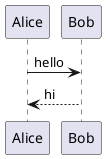

# Birta Writer Showcase

Scroll through this file in the editor to see every content type it renders - one example each, none of the fine print. The full corpus, with every variant, rejection form, and deliberate failure state, lives in [the content inventory](content-inventory.md).

## Text styles

**Bold**, _italic_, ~~strikethrough~~, ==highlight==, and `inline code`. Combine as needed: ***italic bold ==highlight== and `code`.***

## Links

- An inline link: [Birta Writer](https://example.com)
- A section link within this file: [jump to Showcase](#showcase)
- A wikilink: [[README]]

## Showcase

- Bullets
  1. and nesting
     - [x] with mixed list types

> [!TIP]
> Callouts get an icon, an accent color, and an editable title.

| Column | Another column | A third column |
|---|---|---|
| first row | a **formatted** cell | `inline code` or *other formatting* |
| second row | … | … |

## Calculations

Type `=` at the end of a sum for an instant answer, functions and constants included:

3+log10(2²+3²*2.3303)/π^2

Or type `=>` for a living calculation, which adds variables and unit conversions:

a = 3+3^2

3 + a =>

Or keep a whole worksheet:

```calc
income = 5000, rent = 1500
left = income - rent
3 km in mi
```

$$
\int_0^1 x^2 \, dx = \frac{1}{3}
$$

## Images


## Code

```js
function greet(name) {
    return `Hello, ${name}!`;
}
```

## Diagrams




## Math

Inline $E = mc^2$, and block:

## Embeds

A bare provider link on its own line becomes a card - YouTube, Vimeo, Loom, and Figma players, plus GitHub info cards. The GitHub card is built offline from the URL alone; the players need the network switch, which ships **off** (Cmd+Shift+P → "Toggle Network Features" - until then they stay plain links):

https://www.youtube.com/watch?v=dQw4w9WgXcQ

https://github.com/harlanlewis/birta-writer

## Footnotes

Some claims deserve a footnote.[^1]

[^1]: Like this one.

## Raw HTML

<div align="center"><strong>Raw HTML renders as a safe, read-only preview.</strong></div>

## Frontmatter

See the very top of this file - the YAML block renders as an editable table, and round-trips losslessly.

## Horizontal rule

---

That's the tour. The [content inventory](content-inventory.md) has the rest - marker fidelity, rejection grammars, proofreading fixtures, and the expected-failure states.
