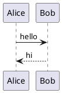

# Birta Writer Showcase

Scroll through this file in the editor to see every content type it renders - one example each, none of the fine print. The full corpus, with every variant, rejection form, and deliberate failure state, lives in [the content inventory](content-inventory.md).

## Text styles

**Bold**, _italic_, ~~strikethrough~~, ==highlight==, and `inline code`. Combine as needed: ***italic bold ==highlight== and `code`.***

Five paired HTML tags render live too, with the tags dimmed to chips you can click to edit: <u>underline</u>, H<sub>2</sub>O, x<sup>2</sup>, <kbd>Cmd</kbd>, and <mark>marked text</mark>. Display only, so the file keeps the tags you wrote.

## Links

- An inline link: [Birta Writer](https://example.com)
- A section link within this file: [jump to Showcase](#showcase)
- A wikilink: [[README]]

## Showcase

- Bullets
  1. and nesting
     - [x] with mixed list types

> [!TIP]
> Callouts get an icon, an accent color, and an editable title.

| Column | Another column | A third column |
|---|---|---|
| first row | a **formatted** cell | `inline code` or *other formatting* |
| second row | … | … |

## Calculations

Type `=` at the end of a sum for an instant answer, functions and constants included:

3+log10(2²+3²*2.3303)/π^2

Or type `=>` for a living calculation, which adds variables and unit conversions:

a = 3+3^2

3 + a =>

Or keep a whole worksheet:

```calc
income = 5000, rent = 1500
left = income - rent
3 km in mi
```

## Images


## Code

```js
function greet(name) {
    return `Hello, ${name}!`;
}
```

## Diagrams




## Math

Inline $E = mc^2$, and block:

$$
\int_0^1 x^2 \, dx = \frac{1}{3}
$$

## Embeds

A bare provider link on its own line becomes a card - YouTube, Vimeo, Loom, Figma, Google Docs/Sheets/Slides/Drive, and Miro players, the CodePen, CodeSandbox, and StackBlitz playgrounds, plus GitHub and Linear info cards. The info cards are built offline from the URL alone; the players need the network switch, which ships **off** (Cmd+Shift+P → "Toggle Network Features" - until then they stay plain links). Each provider also has its own switch, on by default, so any one of them can be turned off without the others. With the network on, a GitHub link fills its card in with the repository, issue or pull request's real title and state:

https://www.youtube.com/watch?v=dQw4w9WgXcQ

https://github.com/harlanlewis/birta-writer

## Footnotes

Some claims deserve a footnote.[^1]

[^1]: Like this one.

## Raw HTML

<div align="center"><strong>Raw HTML renders as a sanitized preview, editable in place.</strong></div>

Click it, or press Cmd+Enter with a tag selected, and the raw source opens in a small panel right where it stands. Every other kind of block opens the same way with Cmd+/, which hands you that block's own Markdown.

Which matters most for the shapes Markdown cannot spell, like a table with merged cells:

<table>
<tr><th>Column</th><th colspan="2">Spans two</th></tr>
<tr><td>Row</td><td>left</td><td>right</td></tr>
</table>

A `<summary>` keeps its native toggle, the one piece of rendered HTML that stays interactive. Everything else, including the body below, opens the source when clicked.

<details>
<summary>Open me</summary>
The body is rendered HTML rather than markdown, and its bytes are preserved exactly.
</details>

## Frontmatter

See the very top of this file - the YAML block renders as an editable table, and round-trips losslessly.

## Horizontal rule

---

That's the tour. The [content inventory](content-inventory.md) has the rest - marker fidelity, rejection grammars, proofreading fixtures, and the expected-failure states.
