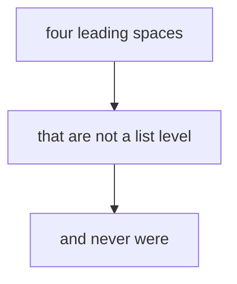

# Four-space outline beside a colliding verbatim indent

The subject of this fixture is a COLLISION, not an outline. Plenty of authoring
tools write nesting four spaces per level while this editor's serializer writes
two, so the merge has to learn the file's own spelling from its zero-edit round
trip. What makes the shape hostile is a second construct whose leading
whitespace happens to be the same width and means nothing structural: a fenced
diagram body, an indented code block.

- level 1
    - level 2
        - level 3
            - level 4
                - level 5
                    - level 6
                        - level 7
                            - level 8

A paragraph between the two constructs, so the outline and the fence are not
adjacent and the classifier has to carry its context across prose.

An indented code block, whose leading whitespace is likewise the user's own
layout rather than a nesting level:

    def collide():
        return "    "

- a second outline, to prove the first one's depths are not the only evidence
    - and that a file may hold two of them
        - at the same spelling

Trailing prose, so the document does not end inside a construct.
