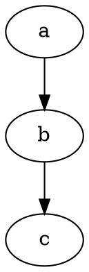
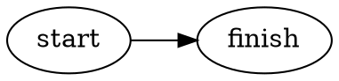
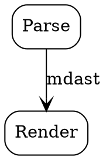
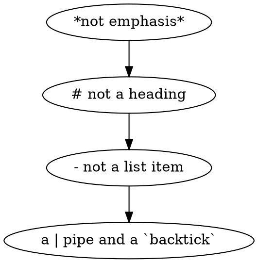
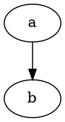
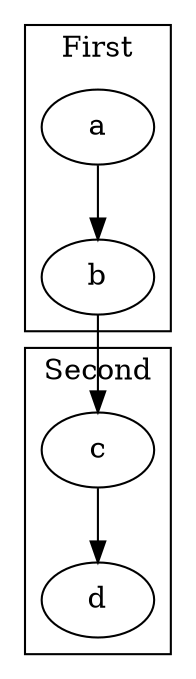

# Graphviz diagrams

Corpus ballast for the Graphviz render path (MAR-330). Nothing here is about
whether a graph *renders* — `e2e/graphvizRender` owns that, in a real browser
against the real WebAssembly engine. This fixture exists for the round-trip
suites: a fenced graph is opaque text to the serializer, and every shape below
must come back byte-identical through a save that carries an edit elsewhere.

The shapes were chosen because each one has a way to go wrong that the others
do not.

## All three fence spellings

The picker's canonical language is `dot`, matching refractor's grammar name;
`graphviz` and `gv` are aliases that normalize onto it. A save must preserve
whichever one the author wrote rather than rewriting it to the canonical
spelling.





```gv
graph Undirected {
  x -- y;
}
```

## Braces and semicolons at line ends

DOT is brace-delimited, and a serializer that treated a fence body as Markdown
would find a lot to normalize here. Nothing in this block may move.



## Quoted labels holding Markdown punctuation

A label can contain the characters that mean something in Markdown. These are
inside a fence and must stay literal: no emphasis, no list, no heading.



## Comments, both spellings

DOT takes C-style comments. `//` at the start of a line is the shape most
likely to be mistaken for something else on the way through.



## Subgraphs and clusters

Nested braces, which is where a naive brace-counter loses the fence.



## An empty graph

A valid graph with no statements. The body is one line and the fence still has
to survive it.

```dot
digraph Empty {}
```

## Invalid DOT stays invalid

A body the engine will refuse. Round-trip fidelity does not care whether a
fence's contents parse, and this is here to prove that: the bytes come back
unchanged whether or not anything can render them.

```dot
digraph Broken {
  a -> ;
```
