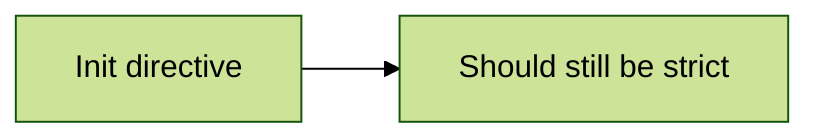
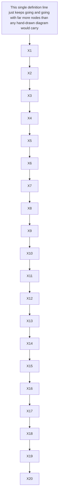

# Hostile content

Every previewable or interpreting surface below gets input it should refuse gracefully: the invariant is that nothing here may hang the editor, crash the webview, or execute. Each block names its target. Companion to `mixed-real-document.md`, which is real-shaped; this one is adversarial.

## Calc fed non-math

```calc
https://example.com/path?q=1&r=2

[link](https://example.com)
1/0
2^^3
x = = 7
(((((
99999999999999999999999999 * 99999999999999999999999999
0xDEADBEEF + €42
<b>bold?</b>
```

## KaTeX fed broken and expensive input

```latex
\frac{1}{
```

```math
\begin{matrix} 1 & 2 \\ 3
```

Inline math with an unclosed brace $\sqrt{x$ and a huge box $\rule{9999px}{9999px}$ in one sentence.

## Mermaid fed directives, callbacks, and junk





```mermaid
not a diagram type at all
```

## Images fed bad sources


)


## Links fed dangerous or absurd targets

[javascript link](javascript:alert\(1\)) and [data link](data:text/html,<script>x</script>) and a [very long target](https://example.com/a?x=0000000000000000000000000000000000000000000000000000000000000000000000000000000000000000000000000000000000000000000000000000000000000000000000000000000000000000000000000000000000000000000000000000000000000000000000000000000000000000000000000000000000000000000000000000000000000000000000000000000000000000).

https://github.com/%00owner/repo-with-junk-id

## Raw HTML fed active content

<script>document.title = "should never run";</script>

<iframe src="https://example.com"></iframe>


<div><div><div><div><div><div><div><div><div><div><div><div>twelve deep</div></div></div></div></div></div></div></div></div></div></div></div>

## Tables fed pathological shapes

| a | b | c | d | e | f | g | h | i | j | k | l | m | n | o | p | q | r | s | t | u | v | w | x | y | z | aa | bb | cc | dd |
|---|---|---|---|---|---|---|---|---|---|---|---|---|---|---|---|---|---|---|---|---|---|---|---|---|---|---|---|---|---|
| 1 | 2 | 3 | 4 | 5 | 6 | 7 | 8 | 9 | 10 | 11 | 12 | 13 | 14 | 15 | 16 | 17 | 18 | 19 | 20 | 21 | 22 | 23 | 24 | 25 | 26 | 27 | 28 | 29 | 30 |

| mismatched | columns |
|---|---|---|---|
| one |
| one | two | three | four | five | six |

## Structure fed edge shapes

Text with a zero-width space [​] and an RTL override [‮reversed?‬] and control-adjacent characters.

- level 1
  - level 2
    - level 3
      - level 4
        - level 5
          - level 6
            - level 7
              - level 8

A footnote that cites itself.[^self]

[^self]: See the footnote.[^self]

```';DROP TABLE languages;--
a fence whose language string is hostile
```
