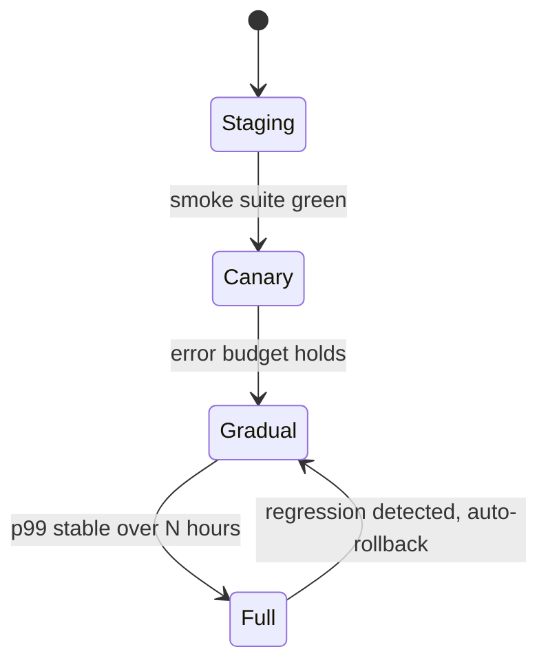
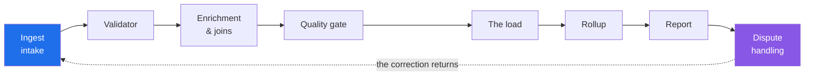
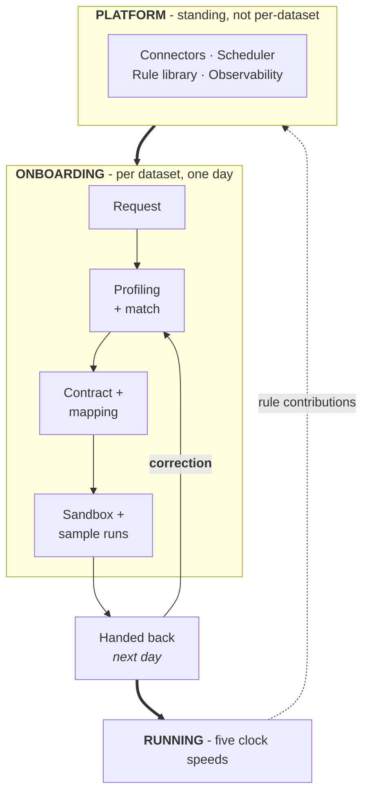
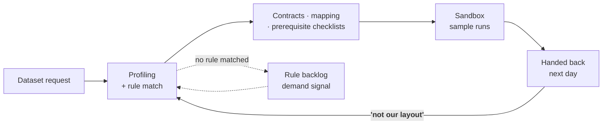

# Data pipeline platform — operations review

This document is corpus ballast shaped like a real working file: long unwrapped paragraphs, a dozen tables, and several mermaid diagrams with HTML labels, subgraphs, and one deliberately broken definition. It exists because the failure that motivated it lived exactly in this mix — every construct below was present in the document that froze the editor on open, and none of them appeared together in any synthetic fixture. The prose is generic on purpose; the shapes are what matter. A paragraph in a file like this routinely runs long without a single line break, because the authoring tool treats one paragraph as one line, and any pipeline that assumes a soft ceiling on line length meets a nine-hundred-character line the first time a user pastes a summary out of a meeting transcript, which is what this sentence is imitating as it keeps going well past the point where wrapped prose would have folded, precisely so that anything sensitive to line length gets exercised by a document that otherwise looks perfectly ordinary.

## The feedback cycles

A pipeline in production feeds five maintenance cycles, each on its own clock.

```mermaid
flowchart TB
    JOBS((["<b>Jobs running<br/>in production</b>"]))

    JOBS --> RETRY["<b>Retry</b><br/>an operator re-runs the job"]
    RETRY -->|"hours"| JOBS

    JOBS --> REG["<b>Regression</b><br/>failures become test cases"]
    REG -->|"days"| JOBS

    JOBS --> REP["<b>Reporting</b><br/>the results roll up"]
    REP -->|"weeks"| JOBS
```

The diagram above is deliberately invalid: `(([...]))` is not a mermaid node shape, so the renderer must settle on its error card and leave the rest of this document alive. That is the pinned regression — a document with one unparseable diagram used to freeze the whole window before first interaction.



## Who owns each cycle

| Cycle | Owner | What they need | Clock | Status | Notes |
|---|---|---|---|---|---|
| **Retry** | **Operator** | Errors that say what went wrong | hours | live | previews before a re-run |
| **Regression** | **Test lead** | Replay against history | days | partial | safeguards before a run |
| **Reporting** | **Analyst** | Numbers they can recompute | weeks | planned | transparent queries |
| **Access** | **Admin** | An audit trail per grant | months | planned | scoped tokens |
| **Schema** | **Data engineer** | The whole migration up front | quarters | live | in the form their team fills in |
| **Tooling** | Platform | - | continuous | live | sets throughput of the rest |

Three consequences fall out of writing it this way.

**Reporting closes the loop.** The pipeline writes to *and* reads from the same warehouse, so a job's output quality shows up in its own next run's input.

**The regression suite is load-bearing.** The more runs recorded, the more confidently the schedule changes — the inverse of a system where scale makes every change scarier.

> Slow cycles are gated by fast ones. No access tier without the audit trail; no audit trail without retry volume already burned down. So onboarding should maximize *turns of the fast cycles*, not dataset size.

## One role: the queue operator

An operator works a queue. A job fails. Check the logs. Check the input batch. Find the upstream delivery inside the retention window. Get the re-run approved if the dataset needs one. Re-run it. Post the summary. Then — and this almost never happens — find out whether the downstream report actually recovered.



### Stage inventory

| Stage | Owner | System | Latency |
|---|---|---|---|
| Intake | Operator | queue | minutes |
| Validation | Operator | rules engine | hours |
| Quality gate | Steward | dashboard | days |
| Load | Scheduler | warehouse | minutes |
| Rollup | Operator | pipeline | hours |
| Dispute | Analyst | ticketing | weeks |

## Onboarding a new dataset





## Rollout ledger

Numbers here are illustrative and belong to `metrics.example`; recompute before quoting.

| Quarter | Datasets | Runs | Retries | Pass rate | Tier |
|---|---|---|---|---|---|
| Q1 | 2 | 1,200 | 240 | 61% | staging |
| Q2 | 5 | 8,400 | 610 | 74% | canary |
| Q3 | 9 | 31,000 | 1,140 | 83% | gradual |
| Q4 | 14 | 90,500 | 2,020 | 90% | gradual |
| Q5 | 19 | 178,000 | 2,400 | 94% | full |
| Q6 | 23 | 301,000 | 2,650 | 96% | full |

- [x] Contract template reviewed by the pilot teams
- [x] Prerequisite generator covers the top three connectors
- [ ] Replay harness green against six months of history
- [ ] Analyst-facing numbers recomputable from the ledger export

The inventory of open questions lives with the [working group](https://example.com/working-group), and the interface contracts are in the [schema spec](https://example.com/schema-spec). Anything quoted from either should link the claim at the point of use rather than restating it, which is also how this document avoids inventing numbers of its own.
