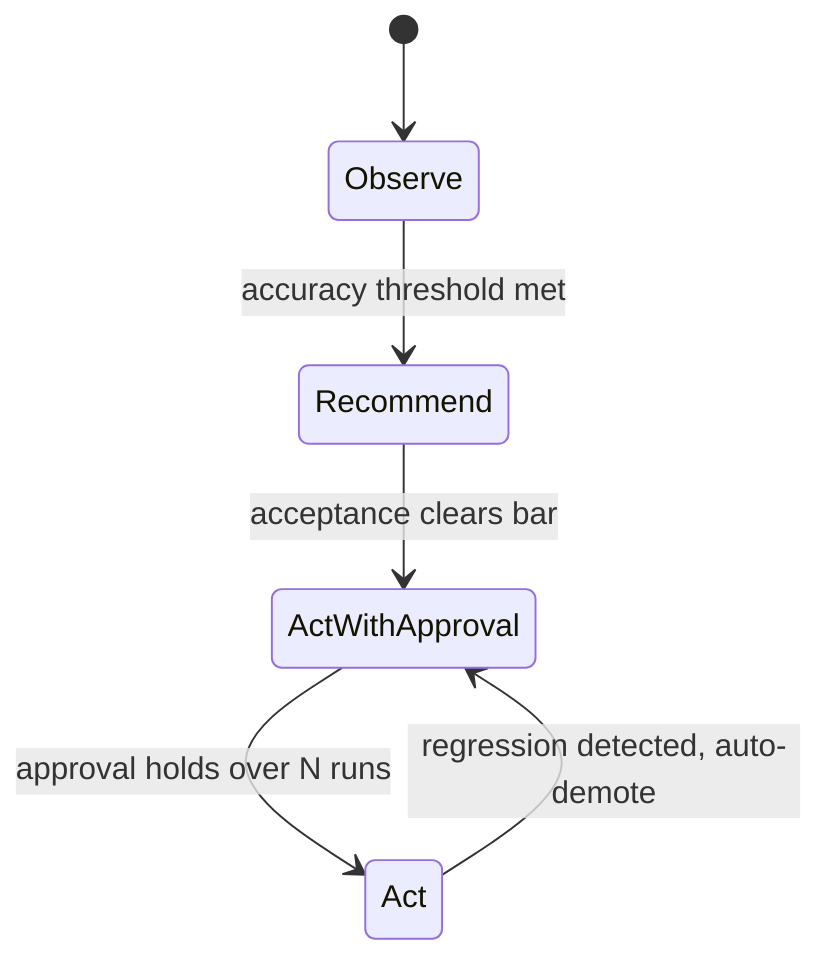
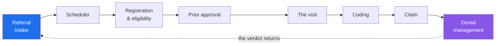
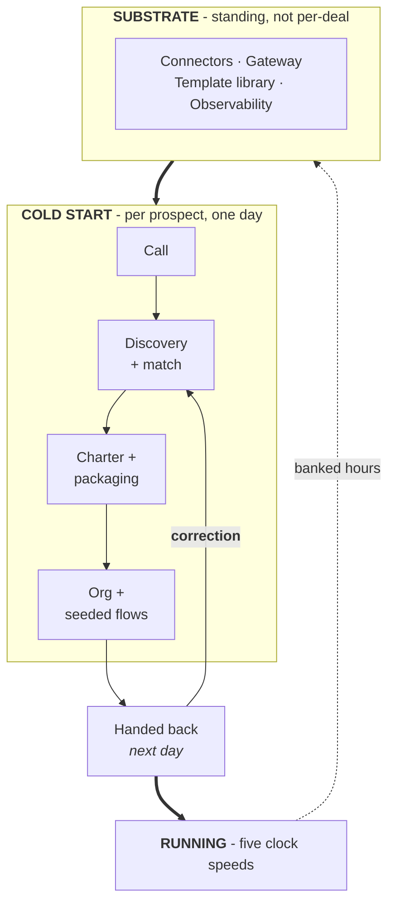
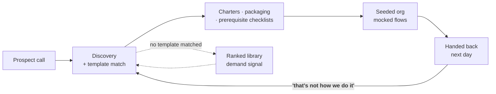

# Field operations platform — review and rollout

This document is corpus ballast shaped like a real working file: long unwrapped paragraphs, a dozen tables, and several mermaid diagrams with HTML labels, subgraphs, and one deliberately broken definition. It exists because the failure that motivated it lived exactly in this mix — every construct below was present in the document that froze the editor on open, and none of them appeared together in any synthetic fixture. The prose is generic on purpose; the shapes are what matter. A paragraph in a file like this routinely runs long without a single line break, because the authoring tool treats one paragraph as one line, and any pipeline that assumes a soft ceiling on line length meets a nine-hundred-character line the first time a user pastes a summary out of a meeting transcript, which is what this sentence is imitating as it keeps going well past the point where wrapped prose would have folded, precisely so that anything sensitive to line length gets exercised by a document that otherwise looks perfectly ordinary.

## The loops

Work in production feeds five feedback loops, each on its own clock.

```mermaid
flowchart TB
    WORK((["<b>Work running<br/>in production</b>"]))

    WORK --> EX["<b>Exception</b><br/>a human corrects the run"]
    EX -->|"hours"| WORK

    WORK --> EV["<b>Eval</b><br/>history becomes the suite"]
    EV -->|"days"| WORK

    WORK --> OUT["<b>Outcome</b><br/>the consequence returns"]
    OUT -->|"weeks"| WORK
```

The diagram above is deliberately invalid: `(([...]))` is not a mermaid node shape, so the renderer must settle on its error card and leave the rest of this document alive. That is the pinned regression — a document with one unparseable diagram used to freeze the whole window before first interaction.



## Who turns them

| Loop | Who turns it | What they need | Clock | Status | Notes |
|---|---|---|---|---|---|
| **Exception** | **Operator** | Errors that say what went wrong | hours | live | previews before a big send |
| **Eval** | **Builder** | Replay against history | days | partial | safeguards before a run |
| **Outcome** | **Manager** | Numbers they can recompute | weeks | planned | transparent assumptions |
| **Permission** | **Architect** | A sandbox strong enough to defend | months | planned | audit trail attached |
| **Depth** | **Integrator** | The entire ask up front | quarters | live | in the form their team fills in |
| **Factory** | R&D | - | continuous | live | sets throughput of the rest |

Three consequences fall out of writing it this way.

**The outcome loop is the one nobody else has.** We write to *and* read from the same system of record, so we see the consequence of our own action. That is a labeled example manufactured by production traffic.

**The eval loop is load-bearing.** The more work done, the more confidently things change — the inverse of normal software, where scale slows you down.

> Slow loops are gated by fast ones. No permission tier without the approval rate; no approval rate without exception volume already burned down. So selection should maximize *turns of the fast loops*, not deal size.

## One role: the coordinator

A coordinator works a queue. An order arrives. Check the account. Check status. Find a slot inside the appropriate window. Get the approval if the plan needs one. Book it. Send the records. Then — and this almost never happens — find out whether it stuck.



### Stage inventory

| Stage | Owner | System | Latency |
|---|---|---|---|
| Intake | Coordinator | queue | minutes |
| Eligibility | Coordinator | portal | hours |
| Approval | Payer | fax, still | days |
| Booking | Scheduler | calendar | minutes |
| Records | Coordinator | interface | hours |
| Verdict | Payer | remittance | weeks |

## The cold start





## Rollout ledger

Numbers here are illustrative and belong to `metrics.example`; recompute before quoting.

| Quarter | Sites | Runs | Exceptions | Approval rate | Tier |
|---|---|---|---|---|---|
| Q1 | 2 | 1,200 | 240 | 61% | observe |
| Q2 | 5 | 8,400 | 610 | 74% | recommend |
| Q3 | 9 | 31,000 | 1,140 | 83% | approval |
| Q4 | 14 | 90,500 | 2,020 | 90% | approval |
| Q5 | 19 | 178,000 | 2,400 | 94% | act |
| Q6 | 23 | 301,000 | 2,650 | 96% | act |

- [x] Charter template reviewed by the pilot sites
- [x] Prerequisite generator covers the top three interfaces
- [ ] Replay harness green against six months of history
- [ ] Manager-facing numbers recomputable from the ledger export

The inventory of open questions lives with the [working group](https://example.com/working-group), and the interface contracts are in the [gateway spec](https://example.com/gateway-spec). Anything quoted from either should link the claim at the point of use rather than restating it, which is also how this document avoids inventing numbers of its own.
