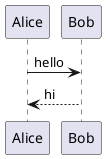
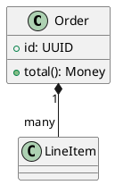
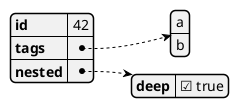
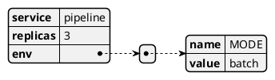
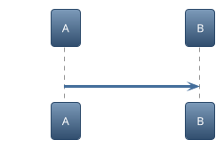
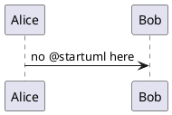
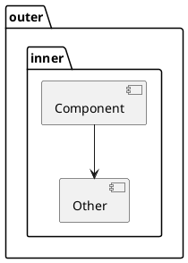
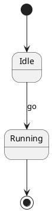

# PlantUML diagrams

Corpus ballast for the PlantUML render path (MAR-30). Nothing here is about
whether a diagram *renders* — `e2e/plantUmlRender` owns that, in a real browser
against the real WebAssembly engine. This fixture exists for the round-trip
suites: a fenced diagram is opaque text to the serializer, and every shape below
must come back byte-identical through a save that carries an edit elsewhere.

The shapes were chosen because each one has a way to go wrong that the others
do not.

## Both fence languages

The picker's canonical language is `plant-uml`; `plantuml` and `puml` are
aliases that normalize onto it. A save must preserve whichever one the author
wrote rather than rewriting it to the canonical spelling.





## A body that is data, not PlantUML

`@startjson` and `@startyaml` parse their contents as literal JSON/YAML. This is
the carve-out in `plantUmlTheme.ts`: injecting a `skinparam` line here does not
theme the diagram, it corrupts the data and fails the render outright. The
braces and colons below are also exactly the characters a serializer is most
likely to want to escape.





## A diagram that fails to render

Deliberately invalid: this fails the engine's diagram-type dispatch, so the pane
settles on its error card. The pinned behaviour is that the rest of the document
stays alive and — the part this corpus checks — that the broken source itself
still round-trips untouched. A file is not repaired by being unrenderable.

Note it took a second attempt to write one of these. PlantUML is lenient, and
the obvious `class {{{ unparseable` renders a small diagram rather than throwing.

```plantuml
@startuml
!!!!! %%%% @@@@
@enduml
```

## A diagram that reaches for the network

`!theme <name>` resolves over HTTP in upstream PlantUML. Our engine is compiled
without remote fetch, so this fails closed rather than fetching anything
(`docs/NETWORK_POSTURE.md`). It is here so the *source* of such a diagram is
known to survive a save — a document that cannot render must still be editable.



## No opening directive

Legal PlantUML: the engine implies `@startuml`. It matters to the theming path,
which has to synthesize the wrapper for the preamble to apply at all, and so has
a different line-number offset than the ordinary case.



## Indentation and blank lines inside the fence

Leading whitespace and blank lines inside a fence are content. A block that
re-indents or drops them has corrupted the diagram even though the file still
looks plausible.



## Beside a Mermaid diagram

Both engines are adapters over one pane, and both are opaque to the serializer.
Having them adjacent catches anything that keys off "the diagram block" rather
than off the specific language.




A closing paragraph so the file does not end on a fence, which is its own
separate edge case (`unclosed-fence-at-eof.md` owns that one).
